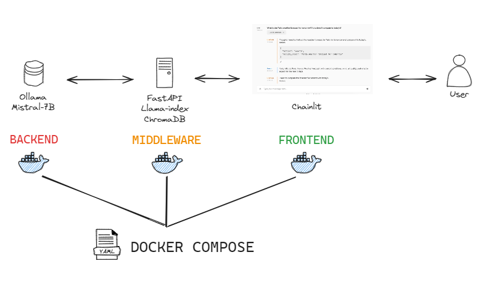

# Generative AI

In this tutorial, we will cover as much Text GenAI practices as we can.


## Objectives

- [ ] Basic Prompt Engineering Techniques
- [ ] Python Programming over locally hosted LLMs
- [ ] Retrieval Augmented Generation
- [ ] Advanced Prompting Techniques

## 1. Text Generation in ChatGPT / HuggingChat

While [OpenAI](https://openai.com/) and [HuggingFace](https://huggingface.co/) offer Web APIs to interact with a cloud-hosted LLM, they operate on a pay-per-use model. 
We are going to use their user interfaces, which are free of use. You are free to create an account on any of the following:

- [ChatGPT](https://chat.openai.com/)
- [HuggingChat](https://huggingface.co/chat)


!!! note "Exercise - Getting used to Chat UI"
    - Open your preferred Chat Interface.
    - Generate a response to "Explain "Generative AI" like I'm 5 years old".
        - GPT systems can be seen as human conversation mimicks, so they perform better with clear, concise prompts relevant to the ongoing conversation and not dealing with open-ended, overly broad prompts.
    - Being a conversational interface, you are free to expand on the conversation by asking for a list of examples, more details on a specific point or advice to get into the field
   
!!! note "Exercise - Classification"
    Write a prompt that is able to classify the following sentences as `neutral`, `negative` or `positive`:
    
    - I loved Star Wars so much!
    - I really don't like NLP (ಥ _ ಥ)
    - I'm hungry

!!! note "Exercise - Coding"
    1. Given a `departments` table with columns `[DepartmentId, DepartmentName]`, and a `students` table with columns `[DepartmentId, StudentId, StudentName]`, write a prompt that generates a MySQL query for all students in the SISE Department
    2. Write a prompt that converts the SQL query to Python SQLAlchemy code
    3. Write a prompt that explains each line of the previous Python code
   
!!! note "Exercise - Text Use Cases"
    Copy & paste the abstract or first paragraph of an [ArXiv paper about LLMs](https://arxiv.org/list/cs.LG/recent) for the following exercise

    - Write a prompt that extracts a list of LLMs from the abstract, and outputs it as a list of bullet points
    - Write a prompt that summarizes the abstract into 3 sentences


## 2. Python Programming over locally hosted LLMs

Closed-source models liks GPT-4 perform well but are limited in terms of transparency and privacy.

You can read [this retrospective of Open Source LLMs](https://huggingface.co/blog/2023-in-llms) for an history of published open LLMs, or the [Open LLM Dashboard](https://huggingface.co/spaces/HuggingFaceH4/open_llm_leaderboard) for a recap of their performance...ask ChatGPT for a summary!

??? abstract "Here are some noteworthy examples available on [Huggingface Hub](https://huggingface.co/models)"
    - for text generation:
        - Mistral-7B
        - Phi 2
        - Vicuna
        - Llama 2
        - Nous-Hermes
    - for code generation:
        - CodeLlama
        - StarCoder
    - for complex reasoning:
        - WizardLM

In this section, we will host our own LLMs and interact with those as if they were exposed from an OpenAI REST API, whose specification has become a template.

### a. LMStudio


[LMStudio](https://lmstudio.ai/) is an easy-to-use, powerful local GUI to run LLMs on your laptop as long as the model has an available [GGUF format](https://github.com/ggerganov/ggml). 

- GGUF is a tensor format that allows CPU inferencing with GPU offloading, making it easy to run a LLM in full CPU mode.

LMStudio uses [llama.cpp](https://github.com/ggerganov/llama.cpp) as backend to run LLMs on CPU with GPU offloading. 

- An alternative for running LLMs on GPUs is [vllm](https://github.com/vllm-project/vllm) using the [GPTQ](https://github.com/IST-DASLab/gptq) or [EXL2](https://github.com/turboderp/exllamav2) formats.

!!! note "Exercise - Playing with LMStudio"
    - Install LMStudio 
    - Search for `Mistral` models, for a list of all available Mistral models on Huggingface Hub stored in GGUF format.
    - From the `TheBloke/Mistral-7B-Instruct-v0.2-GGUF` result, download the `mistral-7b-instruct-v0.2.Q4_K_S.gguf` model.
    - Open a conversation thread and start chatting with the newly downloaded Mistral model.
    - Download a `StarCoder` model. Have it generate SQLAlchemy code like in the previous example.


??? abstract "On choosing a model"
    - Models come in `Base` and `Instruct` versions. 
        - The `Base` model is designed for general-purpose conversations, where the LLM responds to the user's messages in a natural way. For example `What is Generative AI?`. 
        - The `Instruct` mode is trained to follow the user's instructions. For example `Summarize the following text: {text}`
    - In the `Mistral-7B` name, `7B` refers to the model size, here being 7 billion parameters. The parameter count is a rough indicator of its performance on various natural language processing tasks, at the expense of being way harder to store in RAM/vRAM.
    - In general models are trained in FP16 (half-precision), so each weight occupies 16 bits. No one runs such big models, but rather run quantized models by converting the weights from higher precision data types to lower-precision ones. : Q8 (single byte float quant), Q5, Q4 and Q2.
        - Llama2-7B in FP16 takes around 13.5 GB, whereas Llama2-7B in Q4 takes only 4 GB
        - There is quality loss in quantization, but you win on resources and speed of inference. It is still debatable whether it's better to use larger quantized models VS smaller non-quantized models. Unfortunately you will have to test that yourself. Research usually points to larger quantized model outperforming smaller non-quantized in quality and speed.

!!! note "Exercise - REST API with LMStudio"
    Feel free to use a Jupyter Notebook, VSCode script or Streamlit app for the following exercise.

    - Prerequisites: create or reuse a conda environment, install `openai`. 
    - In the `Local Server` tab, start a OpenAI REST API hosting your previously downloaded Mistral-7B.
    - Edit and run the following code, copied directly from the `chat (python)` tab of the Local Inference Server:

    ```python
    # Example: reuse your existing OpenAI setup
    from openai import OpenAI

    # Point to the local server
    client = OpenAI(base_url="http://localhost:1234/v1", api_key="not-needed")

    completion = client.chat.completions.create(
        model="local-model", # this field is currently unused
        messages=[
            {"role": "system", "content": "Always answer in rhymes."},  # the system prompt helps steer the behavior of the model
            {"role": "user", "content": "Introduce yourself."}          # start of the conversation
        ],
        temperature=0.7,
    )

    print(completion.choices[0].message)
    ```

    It may be a bit slow to run, after all you are running on CPU, but logs should appear in LMStudio before the result appears in your script.
    
    Stop the server when you're done.

### b. Ollama in Docker


[Ollama](https://github.com/ollama/ollama) is a tool that allows you to run open-source large language models (LLMs) locally on your machine.

Ollama cannot be used on Windows yet, apart if you're using WSL2...fortunately, you are now Docker experts :wink: and Ollama has an official [Docker image](https://hub.docker.com/r/ollama/ollama)

!!! note "Exercise - Playing with Ollama"
    Feel free to use a Jupyter Notebook, VSCode script or Streamlit app for the following exercise.

    - Prerequisites: create or reuse a conda environment, install `ollama`. 
    - Run ane ollama docker container in the background: `docker run -d -p 11434:11434 --name ollama ollama/ollama`. 
        - Ollama exposes a REST API by default, check <http://localhost:11434/> to see if Ollama is running.
    - Check for available models [here](https://ollama.com/library).
    - Run `docker exec ollama ollama pull mistral` to execute the download mistral model command inside the container.
    - Run `docker exec -it ollama ollama run mistral` to open an interactive shell to Mistral. As previously, chat with Mistral about anything.

    

    - Interact with your downloaded Mistral through the REST API:

    ```python
    import requests
    import json

    # URL for the Ollama server
    url = "http://localhost:11434/api/generate"

    # Input data (e.g. a text prompt)
    data = {
        "model": "mistral",
        "prompt": "What is Generative AI?",
    }

    # Make a POST request to the server
    response = requests.post(url, json=data)

    # Check if the request was successful
    if response.status_code == 200:
        ### TODO: Parse and print the response!

    else:
        print("Error:", response.status_code)
    ```

    - Interact with your downloaded Mistral through the `ollama` client library:

    ```python
    import ollama
    response = ollama.chat(model='mistral', messages=[
        {
            'role': 'user',
            'content': 'Why is the sky blue?',
        },
    ])
    print(response['message']['content'])
    ```

    - Still experimental, interact with your downloaded Mistral through the `openai` client library:

    ```python
    from openai import OpenAI

    client = OpenAI(
        base_url='http://localhost:11434/v1',
        api_key='ollama', # required, but unused
    )

    response = client.chat.completions.create(
    model="mistral",
    messages=[
        {"role": "system", "content": "You are a helpful assistant."},
        {"role": "user", "content": "Who won the world series in 2020?"},
        {"role": "assistant", "content": "The LA Dodgers won in 2020."},
        {"role": "user", "content": "Where was it played?"}
    ]
    )
    print(response.choices[0].message.content)
    ```

### c. Chatbot UI with Chainlit

[Chainlit](https://github.com/Chainlit/chainlit) is a :fr: Python library to easily build conversational UIs, very similar to Streamlit. 


!!! note "Exercise - Playing with Chainlit"
    - Depending on your preference, start a Mistral REST API from LMStudio or Ollama.
    - Edit [this code](https://docs.chainlit.io/get-started/pure-python) to get a quick chatbot running with your locally hosted Mistral.
    - I haven't had time to test, but those should worK:
        - Add [streaming](https://docs.chainlit.io/advanced-features/streaming) to your app by pushing `streaming=True` to the chat completion
        - You can [attach files](https://docs.chainlit.io/advanced-features/multi-modal) to extract info from and use as context for the prompt. Try attaching one of your PDFs, parse it with [PyPDF](https://pypdf2.readthedocs.io/en/3.0.0/) and send the whole content as additional context of your prompt.
  
## 3. Retrieval Augmentated Generation (RAG)

While LLMs are trained on a great deal of data, they are not trained on your data, which may be private or specific to the problem you’re trying to solve. They also suffer from outdated references, hallucinations and untraceable reasoning process.

It is possible but costly to fine-tune a model on your own data. Therefore Retrieval-Augmented Generation (RAG) emerges as a promising solution where you incorporate knowledge for the given prompt as additional context extracted from external documents.


The RAG process comprises of four parts:

- **Loading**: Collecting data from multiple data sources, in multiple formats, with associated metadata
- **Indexing**: Split the documents into chunks of data, create and store vector embeddings out of each document with associated metadata from file
- **Retrieving**: For the given user prompt, retrieve the document chunks closely related to the promt by comparing vector embeddings
- **Generating**: Use the chunks as context for the answer generation


We will recreate a full RAG setup using open source components:

- [Sentence Transformers](https://www.sbert.net/index.html) as the embedding model
- Mistral (or Llama 2) as the LLM, through LMStudio or Ollama REST API
- [ChromaDB](https://www.trychroma.com/) as a vector store to save vector embeddings
- [Llama-index](https://docs.llamaindex.ai/) to orchestrate the RAG

### a. Embeddings

An embedding is a vector (list) of floating point numbers. The distance between two vectors measures their relatedness. Small distances suggest high relatedness and large distances suggest low relatedness.

You can use BERT, S-BERT, or OpenAI's text embeddings

!!! note "Exercise - Understand Embeddings"
    - Create or reuse a conda environment, install `sentence-transformers`. You may also need to upgrade numpy if you get `RuntimeError: Numpy is not available`. 
    - Run some code to generate embeddings for different sentences:

    ```python
    from sentence_transformers import SentenceTransformer

    model = SentenceTransformer("all-MiniLM-L6-v2")

    # Our sentences we like to encode
    sentences = [
        "This framework generates embeddings for each input sentence",
        "Sentences are passed as a list of strings.",
        "The quick brown fox jumps over the lazy dog.",
    ]

    # Sentences are encoded by calling model.encode()
    embeddings = model.encode(sentences)

    # Print the embeddings
    for sentence, embedding in zip(sentences, embeddings):
        print("Sentence:", sentence)
        print("Embedding:", embedding)
        print("")
    ```

    - Compute Vector similarities between embeddings to see how close the original sentences are. Edit the sentences to get a feel for how the cosine similarity changes:
    
    ```python
    from sentence_transformers import SentenceTransformer, util

    model = SentenceTransformer("all-MiniLM-L6-v2")

    # Sentences are encoded by calling model.encode()
    emb1 = model.encode("This is a red cat with a hat.")
    emb2 = model.encode("Have you seen my red cat?")

    cos_sim = util.cos_sim(emb1, emb2)
    print("Cosine-Similarity:", cos_sim)
    ```

    - In a new `data` folder, [download Paul Graham's essay](https://raw.githubusercontent.com/run-llama/llama_index/main/docs/examples/data/paul_graham/paul_graham_essay.txt). In a new Python script:
        - create an embedding for each paragraph. 
        - Then for a given question like `What was my professor's name`, use cosine similarity to print the paragraph which is the closest to the question. 

For any given document, we extract all the content from it, split it into "chunks" like paragraphs and create a vector embedding of each chunk, using a local model or OpenAI's embedding model.

Given a user prompt, we then find the chunks that are closely related to the prompt by looking for the chunk with minimum cosine similarity.

### b. Llama-index quickstart

[Llama-Index](https://docs.llamaindex.ai/en/stable/index.html) is a framework for LLM-based applications with context augmentation through retrieving information from external documents.

In this section (a rewriting of [the starter tutorial](https://docs.llamaindex.ai/en/stable/getting_started/starter_example.html) and [the customization tutorial](https://docs.llamaindex.ai/en/stable/getting_started/customization.html)), we use Llama-index to:

- Split documents into chunks
- Create vector embeddings for each chunk
- Save each chunk and vector embedding in a vector database
- For a user prompt, retrieve the most relevant chunks of information and inject them in the context

!!! note "Exercise - The RAG Chatbot (not totally working yet...)"
    - Install `llama-index`, `llama-index-embeddings-huggingface` and `llama-index-chromadb`
    - Make sure in a new `data` folder, you have [Paul Graham's essay](https://raw.githubusercontent.com/run-llama/llama_index/main/docs/examples/data/paul_graham/paul_graham_essay.txt).
    - Make sure your local Mistral-7B is up
    - In the command-line which will run your Python code, run `set OPENAI_API_KEY=XXXXX`. Our local REST API doesn't need any API key so whatever value would do.
    - In a new `app.py` file, build an index over the documents in the `data` folder. The code automatically reads the file, splits into chunks and embeds them:

    ```python
    from llama_index.core import VectorStoreIndex, SimpleDirectoryReader

    documents = SimpleDirectoryReader("data").load_data()
    index = VectorStoreIndex.from_documents(documents)
    ```

    - To query your newly created index:

    ```python
    query_engine = index.as_query_engine()
    response = query_engine.query("What did the author do growing up?")
    print(response)
    ```

    - You can persist the index with `index.storage_context.persist()`. So with the following code, you have a fully fledged llamaindex project:

    ```python
    import os.path
    from llama_index.core import (
        VectorStoreIndex,
        SimpleDirectoryReader,
        StorageContext,
        load_index_from_storage,
    )

    # check if storage already exists
    PERSIST_DIR = "./storage"
    if not os.path.exists(PERSIST_DIR):
        # load the documents and create the index
        documents = SimpleDirectoryReader("data").load_data()
        index = VectorStoreIndex.from_documents(documents)
        # store it for later
        index.storage_context.persist(persist_dir=PERSIST_DIR)
    else:
        # load the existing index
        storage_context = StorageContext.from_defaults(persist_dir=PERSIST_DIR)
        index = load_index_from_storage(storage_context)

    # Either way we can now query the index
    query_engine = index.as_query_engine()
    response = query_engine.query("What did the author do growing up?")
    print(response)
    ```

## 4. Final Use case

!!! note "Exercise - Build your own chatbot"
    Tackle one of the following problems _(or create one yourself!)_ using both external documents embedded in a vector store, and a well defined system prompt to tune the model behavior, using Chainlit or Streamlit as an UI

    - You are a looking for an internship. Build a chatbot that loads some Linkedin job openings and guide the student sharing experiences/skills, side projects and short-term career dream
    - You are looking for a fancy restaurant. Build a chatbot that loads multiple menu PDFs and guide the user that shares tastes and moods to the chat.

!!! danger "Exercise - :star2: The Final Dockerization :whale:"
    If you want to deploy this to the Cloud, well its DOCKER time :smiling_imp: put everything in a Docker Compose and push your project to Github.

    - Using only the `README.md` I should be able to properly run the project. 
    - Go read your MLOps scikit-learn project for a good template. Imagine your scikit-learn trained model and your vector store of embeddings are the same.
    - A more modular version would be to put ChromaDB in a separate container, that way you can switch vector stores or update it easily. But do it only if you have some time to kill. 
    - :wink: **GOOD LUCK!**

    


---

## ===== Bonus Challenges =====

## 5. Advanced Techniques

Generative Text AI is still in its infancy, a lot of techniques are still appearing. Here's a list of techniques to keep in mind for the more advanced use cases.

### a. Function Calling & Agents

!!! note "Exercise - Function Calling"
    - TODO

!!! note "Exercise - Agents"
    - TODO

### b. Advanced Prompting

!!! note "Exercise - Test the following in ChatGPT"
    - Few-shot prompting: https://www.promptingguide.ai/techniques/fewshot
    - Chain of thoughts: https://www.promptingguide.ai/techniques/cot
    - ReAct: https://www.promptingguide.ai/techniques/react

!!! note "Exercise - DSPy"
    - [DSPy](https://github.com/stanfordnlp/dspy) is a new LLM-based framework that touts itself as the "Keras for LLMs" and makes it easier to do [multi-hop question answering](https://dspy-docs.vercel.app/docs/tutorials/simplified-baleen). I haven't tested it yet but it has dedicated "layers" for ReAct or Chain Of Thought. You can follow the [quick start](https://dspy-docs.vercel.app/docs/quick-start/minimal-example) and then the [Modules page](https://dspy-docs.vercel.app/docs/building-blocks/modules).

### c. Synthetic data

### d. Adversarial Prompting & Guardrails

## 6. Finetuning

Librairies like [Unsloth](https://github.com/unslothai/unsloth) and [Axolotl](https://github.com/OpenAccess-AI-Collective/axolotl) help you finetune a model by managing [PEFT](https://huggingface.co/blog/peft).

Start from one of the [Unsloth Colab notebooks](https://github.com/unslothai/unsloth?tab=readme-ov-file#-finetune-for-free).