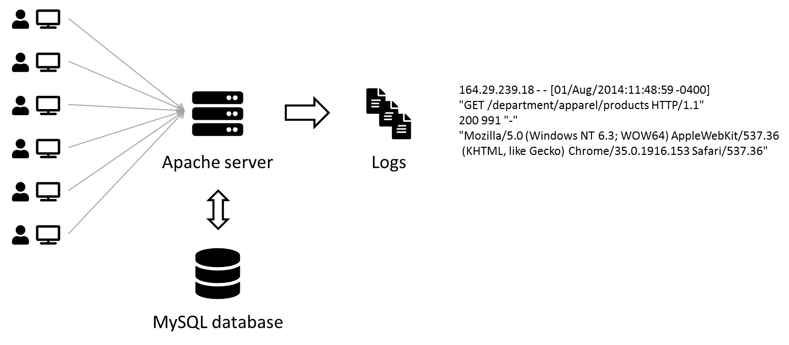
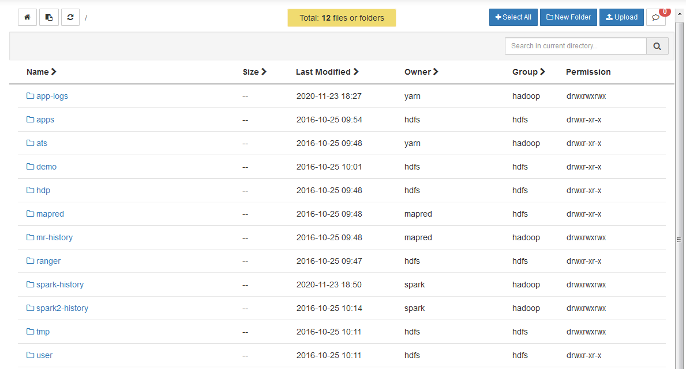
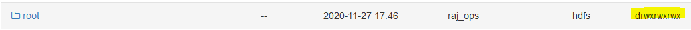
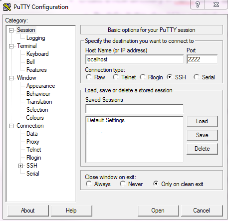
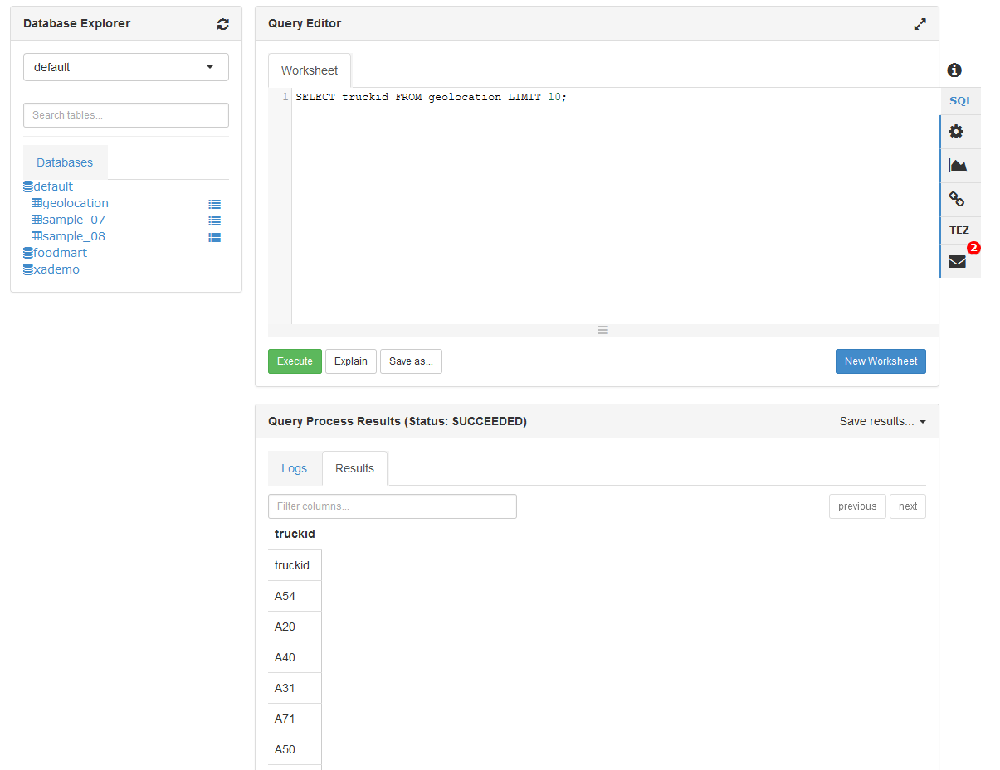
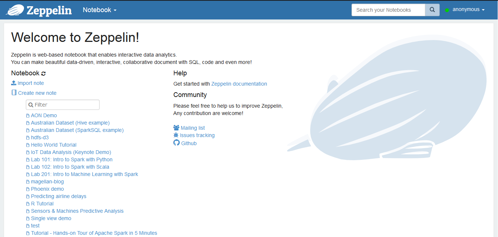
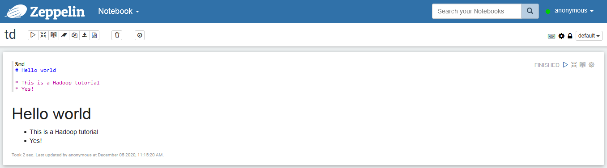
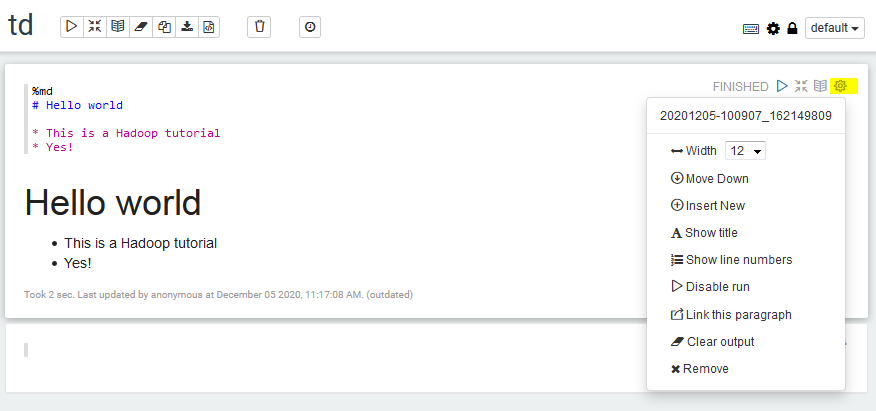
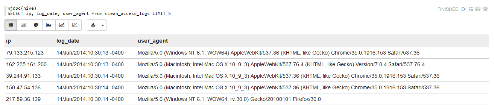

# TD1 - Entering the Hadoop ecosystem

Log analysis is one of the first use cases enabled by Big Data Processing, from parsing web crawlers logs to analyzing customer behavior on websites by rebuilding their sessions from Apache logs.



In this practice session, we will replicate a (albeit smaller) Big Data pipeline to collect and visualize Apache logs.


!!! warning "Saving some memory using Terminal"
    This tutorial makes heavy use of Hive and Zeppelin to process data. If you are using less than 8 Go of RAM for the virtual machine, try to not use Ambari for this session and only use the terminal to upload and manage data in HDFS. Ambari consumes a lot of memory when acessed so this saves some resources.    

1. The first part of the tutorial will focus on managing our cluster through [Ambari](https://ambari.apache.org/) and playing with some Hadoop features.
2. We will then solve the log analysis problem.

## Objectives

- [ ] Monitor the status of your cluster through the Ambari interface
- [ ] Upload data into HDFS - Hadoop Distributed File System
- [ ] Run MapReduce jobs on data in HDFS
- [ ] Run Hive jobs on data in HDFS
- [ ] Structure Apache logs with Hive and regex
- [ ] Build a data dashboard with Zeppelin
- [ ] Ingest Apache logs into HDFS in realtime with Flume

---

## 1. Monitor your cluster with the Ambari interface

!!! note "Exercise - Access the Ambari Dashboard"
    - There are 2 ways to access the Ambari UI:
        - Open a web browser to [http://localhost:8888](http://localhost:8888) to be greeted with the Hortonworks Data Platform dashboard. Click on `Launch Dashboard` in the left column to pop-up a new browser to Ambari. 
        - You can also go to [http://localhost:8080](http://localhost:8080) directly.
    
    - Enter the following credentials on the form: **raj_ops**/**raj_ops**. You will arrive on the Ambari dashboard, your cockpit into the Hadoop platform.


- In the left sidebar, you should recognize some of the Hadoop services presented in the lecture.
- The main area displays KPIs to monitor the platform. Apart from Supervisors Live, there should not have too many red flags.
- The topbar has a few links to running services, list of hosts and an admin portal.
- Some links go to `http://sandbox.hortonworks.com`, replace that by `http://localhost` if you want to check them out.

!!! question "Questions on the Ambari dashboard"
    - How many Namenodes/Datanodes are currently running in the virtual machine ?
    - What is the jdbc URL to connect to the Hive server ?
    - The YARN cluster comprises of a Resource Manager and a Node Manager. How do you restart all Node Managers ?

---

## 2. Uploading files to HDFS

There are two ways to upload data to HDFS: from the Ambari Files View and from a terminal.

In this section we will:

- [ ] Upload the `data` folder of the project (which you can find [here](https://github.com/andfanilo/lyon2/tree/master/data)) into HDFS through the Ambari Files View
- [ ] SSH into the virtual machine, download the files and then upload the [titanic.csv](https://github.com/andfanilo/lyon2/blob/master/data/titanic.csv) file in HDFS using the command line.

### 2.1 Using the Ambari Files View

!!! question "Question"
    Find the Ambari Files View.



!!! note "Exercise - Upload 2 files to a folder in HDFS"
    - Create a new folder `root` inside `/user`.
    - Change the permissions of the folder `/user/root` to add `group` and `other` write/execute permissions. This will prove necessary so the `root` user can actually access its own folder from the command-line. If done correctly, see image below, the permissions should be `drwxrwxrwx`.
        - Don't know about Unix permissions? [Wikipedia link](https://fr.wikipedia.org/wiki/Permissions_UNIX#Repr%C3%A9sentation_des_droits)
    - Enter the `/user/root` folder, create a new `data` folder and upload `geolocation.csv` and `trucks.csv` inside. You should have `/user/root/data/geolocation.csv` and `user/root/data/trucks.csv` by the end.



We now have data distributed on nodes in HDFS _(even if there's only one node)_!

- **geolocation.csv** – This is the collected geolocation data from the trucks. It contains records showing truck location, date, time, type of event, speed, etc.
- **trucks.csv** – This is data was exported from a relational database and it shows information on truck models, driverid, truckid, and aggregated mileage info.

!!! tip 
    - Imagine the Hadoop Data Platform is actually a remote cluster of machines, so when you upload a big file in HDFS it gets cut into blocks of 64MB and spread accross multiple DataNodes, and the NameNode keeps a reference for this file in HDFS to all blocks in the cluster. It's transparent to us though.
    - The URL `/user/root/data/geolocation.csv` in Ambari Views is actually `hdfs:///user/root/data/geolocation.csv`. The `hdfs:///` specifies to look into the HDFS cluster instead of locally when using a HDFS client.
    - `hdfs:///` is a shortcut for `hdfs://<host>:<port>/` so you won't need to specify `hdfs://sandbox.hortonworks.com:8020/` every time.

**Recap**: 

- [x] Upload the `data` folder of the project (which you can find [here](https://github.com/andfanilo/lyon2/tree/master/data)) into HDFS through the Ambari Files View
- [ ] SSH into the virtual machine, download the files and then upload the [titanic.csv](https://github.com/andfanilo/lyon2/blob/master/data/titanic.csv) file in HDFS using the command line.

### 2.2 Using the Command-line

In this section, we will use the command-line to check that HDFS indeed has our data files in `hdfs:///user/root`, then we will upload the [titanic.csv](https://github.com/andfanilo/lyon2/blob/master/data/titanic.csv).

!!! note "Exercise - Connect into the VM with Putty"    
    - [Download PuTTY](https://www.putty.org/) on Windows. You may already have it. 
    - SSH into localhost on port 2222. To do this, enter `localhost` as Hostname, `2222` as Port and click `Open`
        - On your first attempt, it will be asked to change your root password. Type the current password again then change to a long password. Just remember it for future sessions :smile:.
    - The credentials are **root**/**hadoop**.


??? info inline end "In case you have a problem with Putty"
    - On Windows, if you have another favorite terminal like [Windows Terminal](https://github.com/microsoft/terminal) or [Cmder](https://cmder.app/), feel free to use them. If you're on Mac or Unix, the following should work natively.
    - Open a terminal and directly ssh into the virtual machine with `ssh -p 2222 root@localhost`.
    - You can also connect to a shell in the Virtual machine with your browser in [http://localhost:4200](http://localhost:4200). Credentials are **root**/**hadoop**.

    



!!! note "Exercise - Run your first HDFS command"
    Now that you are connected to your virtual machine:

    - Run the `hdfs` command from the terminal. This should output the help from the command line.
    - Display the version of HDFS with `hdfs version`.

    ??? abstract "Output"
        ```
        ssh -p 2222 root@localhost
        Could not create directory '/home/.../.ssh'.
        The authenticity of host '[localhost]:2222 ([127.0.0.1]:2222)' can't be established.
        Are you sure you want to continue connecting (yes/no)? yes
        Failed to add the host to the list of known hosts (/home/.../.ssh/known_hosts).
        root@localhost's password:
        Last login: Sun Nov 29 13:19:19 2020 from 10.0.2.2
        [root@sandbox ~]# hdfs                                                                       
        Usage: hdfs [--config confdir] [--loglevel loglevel] COMMAND                                 
            where COMMAND is one of:                                                              
        dfs                  run a filesystem command on the file systems supported in Hadoop.     
        classpath            prints the classpath                                                  
        namenode -format     format the DFS filesystem                                             
        secondarynamenode    run the DFS secondary namenode                                        
        namenode             run the DFS namenode                                                  
        journalnode          run the DFS journalnode                                               
        zkfc                 run the ZK Failover Controller daemon                                 
        datanode             run a DFS datanode                                                    
        dfsadmin             run a DFS admin client                                                
        envvars              display computed Hadoop environment variables                         
        haadmin              run a DFS HA admin client                                             
        fsck                 run a DFS filesystem checking utility                                 
        balancer             run a cluster balancing utility                                       
        jmxget               get JMX exported values from NameNode or DataNode.                    
        mover                run a utility to move block replicas across                           
                            storage types                                                         
        oiv                  apply the offline fsimage viewer to an fsimage                        
        oiv_legacy           apply the offline fsimage viewer to an legacy fsimage                 
        oev                  apply the offline edits viewer to an edits file                       
        fetchdt              fetch a delegation token from the NameNode                            
        getconf              get config values from configuration                                  
        groups               get the groups which users belong to                                  
        snapshotDiff         diff two snapshots of a directory or diff the                         
                            current directory contents with a snapshot                            
        lsSnapshottableDir   list all snapshottable dirs owned by the current user                 
                                                        Use -help to see options                     
        portmap              run a portmap service                                                 
        nfs3                 run an NFS version 3 gateway                                          
        cacheadmin           configure the HDFS cache                                              
        crypto               configure HDFS encryption zones                                       
        storagepolicies      list/get/set block storage policies                                   
        version              print the version                                                     
                                                                                                    
        Most commands print help when invoked w/o parameters.                                        
        [root@sandbox ~]# hdfs version                                                               
        Hadoop 2.7.3.2.5.0.0-1245                                                                    
        Subversion git@github.com:hortonworks/hadoop.git -r cb6e514b14fb60e9995e5ad9543315cd404b4e59 
        Compiled by jenkins on 2016-08-26T00:55Z                                                     
        Compiled with protoc 2.5.0                                                                   
        From source with checksum eba8ae32a1d8bb736a829d9dc18dddc2                                   
        This command was run using /usr/hdp/2.5.0.0-1245/hadoop/hadoop-common-2.7.3.2.5.0.0-1245.jar 
        ```

!!! note "Exercise - Moving the HDFS `data` folder to `geoloc`"
    The `hdfs dfs` command gives you access to all commands to interact with files in HDFS. Then `hdfs dfs <command> -h` gives you the command manual.

    - List all folders inside HDFS with `hdfs dfs -ls`.
        - The command `hdfs dfs -ls` will take you to `hdfs:///user/root`. `hdfs` uses your UNIX username to go to the HDFS home location. Since you're connected using `root` in the Virtual Machine, it connects by default to `hdfs:///user/root`.

    - Rename the `hdfs:///user/root/data` folder to `hdfs:///user/root/geoloc` with `hdfs dfs -mv`.
        - Remember by default that `hdfs dfs -mv data geoloc` is equivalent to `hdfs dfs -mv hdfs:///user/root/data hdfs:///user/root/geoloc`.

!!! note "Exercise - Download the Titanic dataset into HDFS"
    - Use the `wget` command to download the [Titanic dataset](https://raw.githubusercontent.com/andfanilo/lyon2/master/data/titanic.csv) in the filesystem of your virtual machine. 
    - Verify the file is present with `ls` and with `head -n 5 titanic.csv`.

    To copy files from your local machine to HDFS, the command is `hdfs dfs -copyFromLocal <local_file> <path_in_HDFS>`.

    - Build the `hdfs:///user/root/test` HDFS folder with `hdfs dfs -mkdir /user/root/test`
        - `/user/root/test` in the context of the target of a HDFS command will be `hdfs:///user/root/test`
    - Copy `titanic.csv` file from the local VM into HDFS at URL `hdfs:///user/root/test`.
    - Check via Ambari Files that all is well


!!! note "Exercise - Changing permissions for hdfs:///tmp"
    - Currently, the `hdfs:///tmp` folder doesn't have permissions for everyone to write in.
    In the Hadoop ecosystem, `root` is not the superuser but `hdfs` is. So we need to be in the `hdfs` user before running set permissions. Run the following script.

    ```sh
    sudo su -
    su hdfs
    hdfs dfs -chmod -R 777 /tmp
    exit # necessary to exit the hdfs user, back to root
    ```

**Recap**

- [x] Upload the `data` folder of the project (which you can find [here](https://github.com/andfanilo/lyon2/tree/master/data)) into HDFS through the Ambari Files View
- [x] SSH into the virtual machine, download the files and then upload the [titanic.csv](https://github.com/andfanilo/lyon2/blob/master/data/titanic.csv) file in HDFS using the command line.

??? abstract "Output"
    ```
    [root@sandbox ~]# hdfs dfs -ls /user/root/geoloc
    Found 2 items
    -rw-r--r--   3 raj_ops hdfs     526677 2020-11-23 17:56 /user/root/geoloc/geolocation.csv
    -rw-r--r--   3 raj_ops hdfs      61378 2020-11-23 17:56 /user/root/geoloc/trucks.csv
    [root@sandbox ~]# hdfs dfs -ls /user/root/test
    Found 1 items
    -rw-r--r--   1 root hdfs      60301 2020-11-24 14:59 /user/root/test/titanic.csv
    [root@sandbox ~]# hdfs dfs -ls /tmp
    Found 6 items
    drwxrwxrwx   - raj_ops   hdfs          0 2020-11-27 16:10 /tmp/.pigjobs
    drwxrwxrwx   - raj_ops   hdfs          0 2020-11-27 16:09 /tmp/.pigscripts
    drwxrwxrwx   - raj_ops   hdfs          0 2020-11-27 16:09 /tmp/.pigstore
    drwxrwxrwx   - hdfs      hdfs          0 2016-10-25 07:48 /tmp/entity-file-history
    drwxrwxrwx   - ambari-qa hdfs          0 2020-11-27 16:46 /tmp/hive
    drwx------   - root      hdfs          0 2020-11-27 15:38 /tmp/temp890518890
    ```

---

## 3. Running a MapReduce job

Time to compute stuff on data in HDFS. You should be using a command-line as the `root` user.

!!! note "Exercise - Run a distributed Pi in MapReduce"
    - Run the Pi example : `yarn jar /usr/hdp/current/hadoop-mapreduce-client/hadoop-mapreduce-examples.jar pi 4 100`.
    - Find the job in the [Ambari Resource Manager UI](http://localhost:8088/cluster).
    - Find the result of the job in the log of the job. Don't forget to replace any `http://sandbox.hortonworks.com` by `http://localhost`.
    - Looking at the help of the function below, what would be `nMaps`? `nSamples`? How can you make the Pi result more precise?
    ```shell
    [root@sandbox ~] yarn jar /usr/hdp/current/hadoop-mapreduce-client/hadoop-mapreduce-examples.jar pi
    Usage: org.apache.hadoop.examples.QuasiMonteCarlo <nMaps> <nSamples>
    ```

!!! note "Exercise - Compute wordcount on files in HDFS"
    Now we want to run a wordcount on a file inside HDFS, let's run it on files inside `hdfs:///user/root/geoloc/`.

    - Run `yarn jar /usr/hdp/current/hadoop-mapreduce-client/hadoop-mapreduce-examples.jar wordcount geoloc/geolocation.csv output`.
        - The command will not work if `hdfs:///user/root/output` already exists, in that case remove the folder with `hdfs dfs -rm -r -f output`.
    - Examine the `hdfs:///user/root/output` folder. You can use `hdfs dfs -ls output` and `hdfs dfs -cat output/part-r-00000`.
        - Can you explain how `part-r-00000` appears ?
    - You can edit the number of reducers running with the flag `-D mapred.reduce.tasks=10` at the correct location in the command. Edit the previous command to change the number of reducers working and output this in a new folder `output2`.
    Examine the `output2` folder. Can you note a difference with the previous execution ?

??? danger "Do you want to know what is the Java MapReduce code in the JAR?"
    I am not going to have you write Java code to compute MapReduce, but in case you are wondering:

    ```java
    import java.io.IOException;
    import java.util.*;
            
    import org.apache.hadoop.fs.Path;
    import org.apache.hadoop.conf.*;
    import org.apache.hadoop.io.*;
    import org.apache.hadoop.mapreduce.*;
    import org.apache.hadoop.mapreduce.lib.input.FileInputFormat;
    import org.apache.hadoop.mapreduce.lib.input.TextInputFormat;
    import org.apache.hadoop.mapreduce.lib.output.FileOutputFormat;
    import org.apache.hadoop.mapreduce.lib.output.TextOutputFormat;
            
    public class WordCount {
            
    public static class Map extends Mapper<LongWritable, Text, Text, IntWritable> {
        private final static IntWritable one = new IntWritable(1);
        private Text word = new Text();
            
        public void map(LongWritable key, Text value, Context context) throws IOException, InterruptedException {
            String line = value.toString();
            StringTokenizer tokenizer = new StringTokenizer(line);
            while (tokenizer.hasMoreTokens()) {
                word.set(tokenizer.nextToken());
                context.write(word, one);
            }
        }
    } 
            
    public static class Reduce extends Reducer<Text, IntWritable, Text, IntWritable> {
        public void reduce(Text key, Iterator<IntWritable> values, Context context) 
          throws IOException, InterruptedException {
            int sum = 0;
            while (values.hasNext()) {
                sum += values.next().get();
            }
            context.write(key, new IntWritable(sum));
        }
    }
            
    public static void main(String[] args) throws Exception {
        Configuration conf = new Configuration();
            
            Job job = new Job(conf, "wordcount");
        
        job.setOutputKeyClass(Text.class);
        job.setOutputValueClass(IntWritable.class);
            
        job.setMapperClass(Map.class);
        job.setReducerClass(Reduce.class);
            
        job.setInputFormatClass(TextInputFormat.class);
        job.setOutputFormatClass(TextOutputFormat.class);
            
        FileInputFormat.addInputPath(job, new Path(args[0]));
        FileOutputFormat.setOutputPath(job, new Path(args[1]));
            
        job.waitForCompletion(true);
    }
            
    }
    ```

## 4. Running SQL jobs with Hive

We as analysts are much more used to using SQL to process our data. The role of datawarehouse package in the Hadoop ecosystem goes to Hive.

In today's world, SQL skills are still very important and one of the primary languages to manipulate data. So always work on your SQL.

!!! note "Exercise - Access the Hive terminal"
    - you can start a Hive shell from your terminal/command-line, with the `hive` command. This is dedicated to simple SQL queries or operational management.
    - or, there's a dedicated Hive View in Ambari, with some visualization capabilities.

!!! note "Exercise - Time to analyze the geolocations data"
    - Move the `trucks.csv` file outside of the `hdfs:///user/root/geoloc` folder to `hdfs:///user/root/trucks`. 
    - Create an external table for the `hdfs:///user/root/geoloc` folder which contains `geolocation.csv`.
    ```sql
    CREATE EXTERNAL TABLE geolocation (truckid STRING, driverid STRING, event STRING, latitude DOUBLE, longitude DOUBLE, city STRING, state STRING, velocity DOUBLE, event_ind BIGINT, idling_ind BIGINT)
    ROW FORMAT DELIMITED
    FIELDS TERMINATED BY ','
    LOCATION '/user/root/geoloc';
    ```
    - Visualize the first rows of the table
    ```sql
    SELECT truckid FROM geolocation LIMIT 10;
    ```




The way Hive works is every file inside the `geoloc` folder is read by Hive as data in the table. This is why we had to move out the `trucks.csv` file.

The commands created a Hive table pointing to a HDFS location. You can drop it, it won't destroy the data in HDFS.

!!! question

    - Are you again able to count the list of distinct cities visited per truckid, and mean velocity per truckid ?
    - On the Ambari View, count the number of distinct cities per trucks and display it on a bar chart.


## 5. Structuring Apache logs with Hive and Regex

### 5.1 Upload data to HDFS

Before building the whole pipeline, let's have a look at a sample of Apache logs.

```
164.29.239.18 - - [01/Aug/2014:11:48:59 -0400] "GET /department/apparel/products HTTP/1.1" 200 991 "-" "Mozilla/5.0 (Windows NT 6.3; WOW64) AppleWebKit/537.36 (KHTML, like Gecko) Chrome/35.0.1916.153 Safari/537.36"
```

A sample of Apache logs is available [here](https://github.com/andfanilo/lyon2/tree/master/data) in the `access.log.2.zip` file. We will upload this data into HDFS, parse it using an external Hive table over it and run some SQL queries.

!!! note "Exercise - Upload logs to HDFS"
    - Download and unzip the folder, locally or in your virtual machine depending on how you want to upload the data in HDFS.
    - Upload the data in HDFS, at the location `/user/root/access`. You should end with `/user/root/access/access.log.2`.


??? abstract "Take a look at the end of the file in HDFS, using the `tail` command in HDFS in the terminal."
    ```sh
    [root@sandbox ~]# hdfs dfs -tail access/access.log.2
    6.1; WOW64; rv:30.0) Gecko/20100101 Firefox/30.0"
    64.232.194.248 - - [14/Jun/2014:23:43:32 -0400] "GET /support HTTP/1.1" 200 887 "-" "Mozilla/5.0 (Windows NT 6.1; rv:30.0) Gecko/20100101 Firefox/30.0"
    138.9.185.141 - - [14/Jun/2014:23:43:32 -0400] "GET /department/golf HTTP/1.1" 200 1075 "-" "Mozilla/5.0 (Windows NT 6.3; WOW64) AppleWebKit/537.36 (KHTML, like Gecko) Chrome/35.0.1916.153 Safari/537.36"
    152.208.225.65 - - [14/Jun/2014:23:43:32 -0400] "GET /department/golf HTTP/1.1" 200 1358 "-" "Mozilla/5.0 (Windows NT 6.1) AppleWebKit/537.36 (KHTML, like Gecko) Chrome/35.0.1916.153 Safari/537.36"
    84.246.94.164 - - [14/Jun/2014:23:43:32 -0400] "GET /department/fitness/category/tennis%20&%20racquet HTTP/1.1" 200 907 "-" "Mozilla/5.0 (Windows NT 6.1; WOW64; rv:30.0) Gecko/20100101 Firefox/30.0"
    167.228.157.189 - - [14/Jun/2014:23:43:32 -0400] "GET /department/outdoors HTTP/1.1" 200 2166 "-" "Mozilla/5.0 (Macintosh; Intel Mac OS X 10_9_3) AppleWebKit/537.36 (KHTML, like Gecko) Chrome/35.0.1916.153 Safari/537.36"
    ```

### 5.2 Build a Hive table over the log file

In the previous tutorial, we created a Hive table over CSV files using the keywords `ROW FORMAT DELIMITED FIELDS TERMINATED BY ','`. The format of the file in HDFS, which Hive will parse on-demand, must be specified at table creation.

Here we will use a `regex` to extract all the information we need from the log files. To enable parsing files in HDFS using regex with Hive, we use a specific SerDe (for serializer/deserializer) `ROW FORMAT SERDE 'org.apache.hadoop.hive.contrib.serde2.RegexSerDe'`. 

This SERDE is not provided by default, we will need to register a `hive-contrib.jar` plugin which contains the class. Otherwise you will get `Caused by: org.apache.hadoop.hive.ql.metadata.HiveException: java.lang.ClassNotFoundException: Class org.apache.hadoop.hive.contrib.serde2.RegexSerDe not found` exceptions.

Let's try this:

!!! note "Exercise - Configuring Hive"
    - Open a terminal to your Virtual Machine.
    - Open a Hive command line: `hive`.
    - Add the `hive-contrib.jar` JAR:

    ```sql
    ADD JAR /usr/hdp/current/hive-client/lib/hive-contrib.jar;
    ```

!!! note "Exercise - Creating an external Hive table"
    - Create an external Hive table `intermediate_access_logs` (copy-paste the following command):
    ```sql
    CREATE EXTERNAL TABLE intermediate_access_logs (
        ip STRING,
        log_date STRING,
        method STRING,
        url_site STRING,
        http_version STRING,
        code1 STRING,
        code2 STRING,
        dash STRING,
        user_agent STRING)
    ROW FORMAT SERDE 'org.apache.hadoop.hive.contrib.serde2.RegexSerDe'
    WITH SERDEPROPERTIES (
        'input.regex' = '([^ ]*) - - \\[([^\\]]*)\\] "([^\ ]*) ([^\ ]*) ([^\ ]*)" (\\d*) (\\d*) "([^"]*)" "([^"]*)"',
        'output.format.string' = "%1$$s %2$$s %3$$s %4$$s %5$$s %6$$s %7$$s %8$$s %9$$s")
    LOCATION '/user/root/access';
    ```

Now whenever you run a SQL query on `intermediate_access_logs`, Hive will run a MapReduce job by first parsing all files in the `/user/root/access` with the provided regex, then run your query. 

??? abstract "Output"
    ```
    hive> DESCRIBE intermediate_access_logs;
    OK
    ip                      string                  from deserializer
    log_date                string                  from deserializer
    method                  string                  from deserializer
    url_site                string                  from deserializer
    http_version            string                  from deserializer
    code1                   string                  from deserializer
    code2                   string                  from deserializer
    dash                    string                  from deserializer
    user_agent              string                  from deserializer
    Time taken: 0.997 seconds, Fetched: 9 row(s)
    hive> SELECT ip, log_date, user_agent from intermediate_access_logs LIMIT 5;
    OK
    79.133.215.123  14/Jun/2014:10:30:13 -0400      Mozilla/5.0 (Windows NT 6.1; WOW64) AppleWebKit/537.36 (KHTML, like Gecko) Chrome/35.0.1916.153 Safari/537.36
    162.235.161.200 14/Jun/2014:10:30:13 -0400      Mozilla/5.0 (Macintosh; Intel Mac OS X 10_9_3) AppleWebKit/537.76.4 (KHTML, like Gecko) Version/7.0.4 Safari/537.76.4
    39.244.91.133   14/Jun/2014:10:30:14 -0400      Mozilla/5.0 (Macintosh; Intel Mac OS X 10_9_3) AppleWebKit/537.36 (KHTML, like Gecko) Chrome/35.0.1916.153 Safari/537.36
    150.47.54.136   14/Jun/2014:10:30:14 -0400      Mozilla/5.0 (Macintosh; Intel Mac OS X 10_9_3) AppleWebKit/537.36 (KHTML, like Gecko) Chrome/35.0.1916.153 Safari/537.36
    217.89.36.129   14/Jun/2014:10:30:14 -0400      Mozilla/5.0 (Windows NT 6.1; WOW64; rv:30.0) Gecko/20100101 Firefox/30.0
    Time taken: 0.29 seconds, Fetched: 5 row(s)
    hive>
    ```

!!! note "Exercise - Transforming the raw Hive table"
    - Running a query on `intermediate_access_logs` will parse files with regex every time, which is time consuming. Create a new `clean_access_logs` table with the output for `intermediate_access_logs` as content.
        - We also optimize the table storage with the [ORC format](https://orc.apache.org/docs/). Using ORC files improves performance when Hive is reading, writing, and processing data.
    - Then build a smaller table so you can experiment on it before running on the full dataset:

    ```sql
    CREATE TABLE clean_access_logs STORED AS ORC AS SELECT * FROM intermediate_access_logs;

    CREATE TABLE sample_access_logs STORED AS ORC AS SELECT * FROM clean_access_logs LIMIT 1000;
    ```

You're now free to work on the `clean_access_logs` or `sample_access_logs` tables :smile:

!!! question "SQL questions"
    Choose 1-2 questions to answer:

    - Can you count the number of occurences for each IP address ?
    - Display how many times each product has been bought
    - What percentage of IP addresses went to checkout their basket ?
    - If you case the date as a Date you should be able to build a web journey of an IP address on the website. For all IP adresses that went to checkout, compute the number of products each has bought before.

### 5.3 Visualize the data with Zeppelin, the Big Data Notebook

Apache Zeppelin is a Web-based notebook for interactive data analytics and collaborative documents. You can plugin multiple interpreters to run different Big Data engine inside, by default Hive JDBC and Spark are already configured to run. 

!!! note "Exercise - Zeppelin usage"
    - Open `http://localhost:9995` for a first peek at Zeppelin.
    - Create a new note, write some [Markdown](https://www.markdownguide.org/) in the first cell with `%md` as a first line to choose the Markdown interpreter, and run the cell:
    - See what happens when you toggle the `default` view to `simple` and `report`.
    - Each cell has its own set of settings too. For example, change the width of the first cell to 6:
    - Create a new cell, set the interpreter to `Hive JDBC` with `%jdbc(hive)` and run a SQL query against `clean_access_logs` again.
    - Do you see that the `Hive JDBC` cell results have a toolbar for displaying graphs? Play with it a bit then try to replicate the following notebook in `report` view, with a cell for counting the number of occurences for a few ip addresses.

??? abstract "All Zeppelin screenshots"
    
    
    
    
    
    

## 6. Generating logs with Python

Instead of installing an Apache server and hitting it with HTTP requests for new logs, we use a Python script to randomly generate logs into a log file.

!!! note "Exercise - Run Python codeto generate logs in realtime"
    - Copy the `gen_logs` folder to the virtual machine and browse inside `cd gen_logs`.
        - Since `git` is installed in the machine, you can directly clone the full project with `https://github.com/andfanilo/lyon2.git`
    - Add execution permissions to the Python and Shell files inside `gen_logs`: `chmod +x *.sh` `chmod +x */*.py`
    - Run Python simulation: `./start_logs.sh`
        - Logs are tailed into `logs/access.log`. In the following sections we should send lines appended to this file into HDFS.
        - You can follow the produced logs with `./tail_logs.sh`.
    - Kill the log generation with `./stop_logs.sh`.

## 7. Ingesting data in HDFS with Flume

[Apache Flume](https://flume.apache.org/index.html) is a distributed, reliable, and available system for efficiently collecting, aggregating and moving large amounts of log data from many different sources to a centralized data store.

It follows a simple yet extensible model of `source > channel > sink` configured through a configuration file.


Using Flume, we will capture generated logs from Python, simulating customer interaction with the ecommerce website, and aggregate them into HDFS for consolidated analysis through Hive/Zeppelin. This is a very common scenario you can read more about [here](https://flume.apache.org/releases/content/1.9.0/FlumeUserGuide.html#consolidation).

### 7.1 Test Flume with a simple logging of telnet info

In this first section, we follow the [Flume quickstart](https://flume.apache.org/releases/content/1.9.0/FlumeUserGuide.html#a-simple-example) and build a Flume agent which routes any network information sent over the wire in port 44444, into a Java logger.

!!! note "Exercise - Configure Flume"
    - Configure Flume by copying [flume/example.conf](https://github.com/andfanilo/lyon2/tree/master/flume) into the virtual machine.
    ??? tip "Help me!"
        Here's a command to copy-paste multiline content directly into `example.conf` in a terminal:
        ```sh
        cat > example.conf << EOF
        # example.conf: A single-node Flume configuration

        # Name the components on this agent
        a1.sources = r1
        a1.sinks = k1
        a1.channels = c1

        # Describe/configure the source
        a1.sources.r1.type = netcat
        a1.sources.r1.bind = localhost
        a1.sources.r1.port = 44444

        # Describe the sink
        a1.sinks.k1.type = logger

        # Use a channel which buffers events in memory
        a1.channels.c1.type = memory
        a1.channels.c1.capacity = 1000
        a1.channels.c1.transactionCapacity = 100

        # Bind the source and sink to the channel
        a1.sources.r1.channels = c1
        a1.sinks.k1.channel = c1
        EOF
        ```

!!! note "Exercise - Run Flume"
    - Run the Flume agent:
    ```sh
    flume-ng agent --conf conf --conf-file example.conf --name a1 -Dflume.root.logger=INFO,console
    ```

!!! note "Exercise - Test Flume is running"
    - Connect another terminal to your Virtual Machine, so you have one terminal with the Flume agent running and this second terminal to send network commands. Connect to localhost on port 44444 with `telnet localhost 44444`. Then send some text.

    ??? abstract "Output"
        Your telnet terminal should have:
        ```sh
        [root@sandbox ~]# telnet localhost 44444
        Trying ::1...
        telnet: connect to address ::1: Connection refused
        Trying 127.0.0.1...
        Connected to localhost.
        Escape character is '^]'.
        coucou
        OK
        hadoop
        OK
        ```
        And your Flume terminal should log the messages from port 44444:
        ```sh 
        [root@sandbox ~]# flume-ng agent --conf conf --conf-file example.conf --name a1 -Dflume.root.logger=INFO,console
        20/12/06 11:02:40 INFO node.PollingPropertiesFileConfigurationProvider: Configuration provider starting
        20/12/06 11:02:40 INFO node.PollingPropertiesFileConfigurationProvider: Reloading configuration file:example.conf
        20/12/06 11:02:40 INFO conf.FlumeConfiguration: Added sinks: k1 Agent: a1
        20/12/06 11:02:40 INFO conf.FlumeConfiguration: Processing:k1
        20/12/06 11:02:40 INFO conf.FlumeConfiguration: Processing:k1
        20/12/06 11:02:40 INFO conf.FlumeConfiguration: Post-validation flume configuration contains configuration for agents: [a1]
        20/12/06 11:02:40 INFO node.AbstractConfigurationProvider: Creating channels
        20/12/06 11:02:40 INFO channel.DefaultChannelFactory: Creating instance of channel c1 type memory
        20/12/06 11:02:40 INFO node.AbstractConfigurationProvider: Created channel c1
        20/12/06 11:02:40 INFO source.DefaultSourceFactory: Creating instance of source r1, type netcat
        20/12/06 11:02:40 INFO sink.DefaultSinkFactory: Creating instance of sink: k1, type: logger
        20/12/06 11:02:40 INFO node.AbstractConfigurationProvider: Channel c1 connected to [r1, k1]
        20/12/06 11:02:40 INFO node.Application: Starting new configuration:{ sourceRunners:{r1=EventDrivenSourceRunner: { source:org.apache.flume.source.NetcatSource{name:r1,state:IDLE} }} sinkRunners:{k1=SinkRunner: { policy:org.apache.flume.sink.DefaultSinkProcessor@11d97d51 counterGroup:{ name:null counters:{} } }} channels:{c1=org.apache.flume.channel.MemoryChannel{name: c1}} }
        20/12/06 11:02:40 INFO node.Application: Starting Channel c1
        20/12/06 11:02:40 INFO instrumentation.MonitoredCounterGroup: Monitored counter group for type: CHANNEL, name: c1: Successfully registered new MBean.
        20/12/06 11:02:40 INFO instrumentation.MonitoredCounterGroup: Component type: CHANNEL, name: c1 started
        20/12/06 11:02:40 INFO node.Application: Starting Sink k1
        20/12/06 11:02:40 INFO node.Application: Starting Source r1
        20/12/06 11:02:40 INFO source.NetcatSource: Source starting
        20/12/06 11:02:40 INFO source.NetcatSource: Created serverSocket:sun.nio.ch.ServerSocketChannelImpl[/127.0.0.1:44444]
        20/12/06 11:04:54 INFO sink.LoggerSink: Event: { headers:{} body: 63 6F 75 63 6F 75 0D                            coucou. }
        20/12/06 11:05:09 INFO sink.LoggerSink: Event: { headers:{} body: 68 61 64 6F 6F                                                                                         70 0D                            hadoop. }
        ```
    
        The two last lines are the most important, they are logged by the Flume sink.

- Close the Flume agent and telnet. 

!!! question "Question: go futher by replacing the logger sink with a HDFS sink"
    Using [vi](https://www.tutorialspoint.com/unix/unix-vi-editor.htm) to edit the `example.conf` file (`vi example.conf` to enter edit mode, `a` to enter append mode and edit the text, `ESC` to exit edit mode, `:wq <ENTER>` to save and exit, `:q! <ENTER>` to exit without saving), look how to change the sink to [HDFS sink](https://flume.apache.org/releases/content/1.9.0/FlumeUserGuide.html#hdfs-sink) and save the netcat commands into `/user/root/netcat` in HDFS for example.

    Absolutely look for the answer on Google!

This example presented how to use Flume configuration to configure a Flume pipeline. In the next section we will build a configuration to tail the logs into HDFS.

### 7.2  Route Apache logs to HDFS with Flume

Time to build [a configuration file](https://flume.apache.org/releases/content/1.9.0/FlumeUserGuide.html#configuration) to route Apache logs into HDFS. 

We will use the following components:

- Source: exec
- Channel: memory
- Sink: HDFS (Hive should be possible too)
- Output in external Hive table

## 8. Improving your Zeppelin Dashboard

- You can add [forms](https://zeppelin.apache.org/docs/0.6.2/manual/dynamicform.html#text-input-form) to a Zeppelin cell, so you can dynamically manipulate your Hive query.
- Build a graph to showcase the quantity of bought articles every 5 minutes, based on the Apache logs generated by the previous section.

## Conclusion

In this tutorial, you deployed a full Big Data pipeline for ingesting simulation data from ecommerce activity into HDFS, ready for data analysis. This pipeline is fully scalable and distributed, so can be used from small to very large activity.

Take a break now, you deserve it :smile: