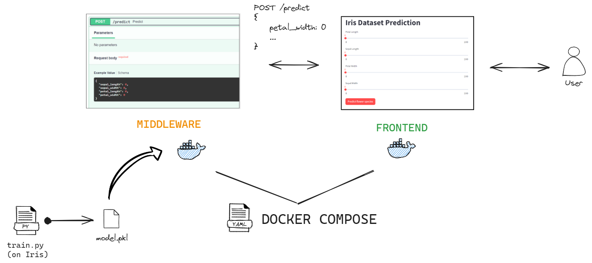

# Advanced Deployment with Kubernetes

In this tutorial, we will cover as much Kubernetes practices as we can.

You can play with a sandboxed Kubernetes (often abbreviated k8s):

* Online with [Play with Kubernetes](https://labs.play-with-k8s.com/) following [this classroom](https://training.play-with-kubernetes.com/kubernetes-workshop/)
* Installing [Minikube](https://minikube.sigs.k8s.io/) in your Docker environment
* Using the preconfigured Kubernetes on Docker Desktop.

The last option being already available to you, we will go with that.

## Prerequisites

* Docker Desktop

## 1. Kubernetes Quick Start


### a. Start Kubernetes

Docker Desktop comes with a deactivated K8s cluster which you can [start on demand](https://docs.docker.com/desktop/features/kubernetes/#install-and-turn-on-kubernetes).

!!! note "Exercise - Start Docker Desktop's K8s cluster"
    - Start up Docker Desktop, go to Settings, check `Enable Kubernetes` and apply & restart
        - When Kubernetes is enabled, its status is displayed in the Docker Desktop Dashboard footer and the Docker menu.
        - Like the `docker` command connects to the Docker cluster, `kubectl` is the command-line tool to run commands against a K8s cluster. 
    - Open a new Command Line terminal to run `kubectl version`
    - Display the cluster info with `kubectl cluster-info`
    - Display nodes in your cluster with `kubectl get nodes`

While Docker handles the creation and running of individual containers on a single host, Kubernetes extends this by orchestrating multiple containers across multiple hosts. 

It also includes scaling, load balancing, and self-healing of containerized applications.

In the next section, we will deploy multiple Docker images on this K8s cluster.

### b. Build Docker images of a FastAPI API

Let's build 3 versions of a Docker image to see how we can deploy and manage their lifecycle on a K8s cluster.

!!! note "Exercise - Build 1 Docker image in 3 different versions"
    - Create a new `app.py` with the following content:
    
    ```python
    from fastapi import FastAPI

    app = FastAPI()

    @app.get("/")
    async def root():
        return {"message": "Hello World"}

    @app.get("/version")
    async def version():
        return {"version": "0.1.0"}
    ```

    - Build a Docker image to expose this Python API. Tag it `api:0.1.0`
        - If you run `docker run --rm -p 8000:8000 api:0.1.0`, you should be able to ping the api on `http://localhost:8000`.
    - Edit the code to add a new endpoint and edit the version endpoint. 
    - Build this edited script into a new Docker image `api:0.2.0`
    - Repeat the process into a new Docker image `api:0.3.0`
  
### c. Deploy a Pod

The Pod is the smallest deployable unit in Kubernetes. Think of it as a small wrapper around one to multiple running container so it runs on Kubernetes as the basic building block.

The most common way to deploy on Kubernetes is by declaring what you want deployed in a YAML manifest file. The YAML specification describes how we want our app to run on Kubernetes, and Kubernetes will do its best to move the current state of the app to match the spec.


!!! note "Exercise - Deploy the Dockerized API into a pod"
    - In a new folder `k8s`, 
    - Create a new `pod.yaml` file.
    - Edit its contents to declare you want one running pod from the Docker image `api:0.1.0` in the `spec`, and `metadata` with a name and set of labels to help identify the pod: 
    
    ```yaml
    apiVersion: v1
    kind: Pod
    metadata:
      name: api-pod
      labels:
        app: api
        version: 0.1.0
    spec:
      containers:
      - name: api
        image: api:0.1.0
        ports:
        - containerPort: 8000
    ```

    - Send the YAML manifest file to Kubernetes, with the command `kubectl apply -f pod.yaml`.
    - Check all running pods on Kubernetes with `kubectl get pods`.
    - Get pod details: `kubectl get pod api-pod -o yaml`
        - Find the `spec` field, which is the desired state from the YAML file, 
        - and the `status` field, which is the current state of the pod
    - Describe the pod with `kubectl describe pod api-pod`.
    - Open a shell inside the pod: `kubectl exec -it api-pod -- /bin/bash`
        - From inside the pod: update all packages `apt update`
        - Install curl: `apt install curl`
        - Ping the api with `curl http://localhost:8000` and `curl http://localhost:8000/version`.
    - Select pods with a specific label, example `kubectl get pods -l app=api`
    - Find and run the command to print the logs from the pod
    - Find and run the command to port-forward port 8000 of the pod and connect to it from the browser on <http://localhost:8000/>.
    - Destroy the pod with: `kubectl delete pod api-pod`
        - Does the pod self-heal/reappear?
    - Recreate the pod with the command `kubectl apply -f pod.yaml`.
    - Officially delete all pods by declaring the deletion of the yaml file: `kubectl delete -f pod.yaml`.

    ??? abstract "Here's a breakdown of the YAML file"
        ```yaml
        # The version of the Kubernetes API you're using
        apiVersion: v1

        # What type of resource you're creating (Pod, Deployment, Service, etc.)
        kind: Pod

        # Metadata about the resource (name, labels, etc.)
        metadata:
        name: api-pod          # The name of your pod
        labels:                # Labels are key-value pairs used for organizing and selecting resources
            app: api            # Example label: app=api

        # The actual specification of what you want to create
        spec:
        containers:           # List of containers in the pod
        - name: api           # Name of the container
            image: api:0.1.0    # Docker image to use
            ports:              # Ports to expose
            - containerPort: 8080  # Port the container listens on
        ```

Now that you have run your Docker image in a Pod on Kubernetes, let's start more pods.


!!! note "Exercise - Deploy more pooodddsss"
    - Edit `pod.yaml` to start 3 pods, 1 per version

    ```yaml
    apiVersion: v1
    kind: Pod
    metadata:
      name: api-pod-1
      labels:
        app: api
        version: 0.1.0
    spec:
      containers:
      - name: api
        image: api:0.1.0
        ports:
        - containerPort: 8000
    ---
    apiVersion: v1
    kind: Pod
    metadata:
      name: api-pod-2
      labels:
        app: api
        version: 0.2.0
    spec:
      containers:
      - name: api
        image: api:0.2.0
        ports:
        - containerPort: 8000
    ---
    apiVersion: v1
    kind: Pod
    metadata:
      name: api-pod-3
      labels:
        app: api
        version: 0.3.0
    spec:
      containers:
      - name: api
        image: api:0.3.0
        ports:
        - containerPort: 8000
    ```

    - Re-apply the declarative spec: `kubectl apply -f pod.yaml`
    - List all pods: `kubectl get pods`
    - Delete the second one: `kubectl delete pod api-pod-2`. Does it self-heal?
    - Rerun `kubectl apply -f pod.yaml`. What do you think happened to each pod?
    - Delete all pods by declaring the deletion of the yaml file: `kubectl delete -f pod.yaml`.

!!! danger "Challenge - Namespaces"
    All the Pods are mixed in the same `default` namespace. Namespaces allow us to logically divide our pods into different sub-groups of the cluster.

    

    After reading on K8s namespaces:

    - Create 3 namespaces `dev`, `qualif` and `prod` namespaces, using a `namespace.yaml` YAML manifest file 
    - Deploy: 
        - `api:0.1.0` in `prod` with a label `environment=prod`, 
        - `api:0.2.0` in `qualif` with a label `environment=qualif` 
        - `api:0.3.0` in `dev` with a label `environment=dev`. 
        - All pods should have the same name `api-pod` but located in different namespaces.
    - Switch between different namespaces to check the existence of your pod.
    - Select all `dev` pods by filtering all pods over the `environment=dev` label.
    - When you are done, `kubectl delete -f pod.yaml` and `kubectl delete -f namespace.yaml` to clean up everything.

The most fundamental concept in Kubernetes is its declarative approach, where you specify your desired state in YAML files, describing what you want to run, how you want it configured, and how it should behave. 

Kubernetes continuously works to ensure that current state matches this specification.

### d. Scale Pods in a Deployment

As seen in the previous section, pods don't self-heal nor scale up and down. It is also not easy to update or rollback an app version of a Pod.

A Deployment is a higher-level Kubernetes resource that manages Pods for you, automatically handling replication, scaling, and updates while maintaining your desired state. 


When a Pod fails or is deleted in a Deployment, Kubernetes automatically creates a new one to converge back to the Deployment desired state. The Deployment also ensures a smooth rolling update by gradually replacing old Pods with new ones, with the ability to rollback if something goes wrong. 

Let's see how to convert our previous Pod specification into a Deployment.

!!! note "Exercise - Deploy 10 replicas of a Pod"
    - Create a new `deployment.yaml` file

    ```yaml
    apiVersion: apps/v1 
    kind: Deployment
    metadata:
      name: api-deploy
    spec:
      replicas: 10
      selector:
        matchLabels:
          app: api
      minReadySeconds: 10
      strategy:
        type: RollingUpdate
        rollingUpdate:
          maxUnavailable: 1
          maxSurge: 1
      template:
        metadata:
          labels:
            app: api
        spec:
          containers:
          - name: api-pod
            image: api:0.1.0
            ports:
            - containerPort: 8000
    ```

    - Declare it to Kubernetes with `kubectl apply -f deployment.yaml`
    - Verify you have 10 pods running in `kubectl get pods`
    - Inspect the deployment with `kubectl get deploy api-deploy` and `kubectl describe deploy api-deploy`
    - Let's see pods self-healing
        - In another Command line, run `kubectl get deploy api-deploy --watch` to watch deployment state in real time
        - Destroy one of the pods: `kubectl delete pod api-deploy-<id>`
        - Analyze the watch. Did it self-heal? Confirm by listing all pods.
    - In the YAML file, change the number of replicas, then reapply the file `kubectl apply -f deployment.yaml`. Watch as the number of replicas grow or shrink depending on the number you entered.

    ??? abstract "Here's a breakdown of the YAML file"
        ```yaml
        # Specifies which version of the Kubernetes API to use
        # apps/v1 is used for Deployments, while v1 was used for Pods
        apiVersion: apps/v1 

        # Indicates we're creating a Deployment (not a Pod, Service, etc.)
        kind: Deployment

        # Basic information about our Deployment
        metadata:
            name: api-deploy    # Name of the Deployment

        # The main configuration section
        spec:
        # Number of Pod replicas to maintain
            replicas: 10       # Kubernetes will ensure 10 Pods are always running

        # Tells Deployment which Pods to manage
            selector:
                matchLabels:
                    app: api       # Will manage any Pod with label app: api

        # Minimum time before a Pod is considered "ready"
            minReadySeconds: 10  # Waits 10 seconds before considering Pod ready

        # Defines how updates should be performed
            strategy:
                type: RollingUpdate              # Update Pods one by one
                rollingUpdate:
                maxUnavailable: 1              # Max number of Pods that can be unavailable during update
                maxSurge: 1                    # Max number of extra Pods during update

        # Template for creating new Pods (similar to Pod YAML we saw earlier)
            template:
                metadata:
                labels:
                    app: api     # Each Pod gets this label (matches selector above)
                spec:
                containers:    # Container specifications (just like in Pod YAML)
                - name: api-pod
                    image: api:0.1.0
                    ports:
                    - containerPort: 8000
        ```

### e. Expose Pods in Deployment with a Service

In order to access the application from a stable name or IP address, we need a Kubernetes Service over a set of pods.


!!! note "Exercise - Expose pods with a service"
    - Make sure your previous deployment of 10 pods with label `app=api` is still running: `kubectl get pods -l app=api`
    - Create a new `service.yaml` file with the following content:

    ```yaml
    apiVersion: v1
    kind: Service
    metadata:
      name: api-svc
      labels:
        app: api
    spec:
      type: NodePort
      ports:
      - port: 8000
        nodePort: 30001
        protocol: TCP
      selector:
        app: api
    ```

    - Open your browser on <http://localhost:30001/docs>. You will be redirected to one of the Pods at random.

    ??? abstract "Here's a breakdown of the YAML file"
        ```yaml
        # Specifies the API version for Services
        apiVersion: v1

        # Defines this as a Service resource type
        kind: Service

        # Metadata section for naming and labeling the service
        metadata:
          # The name of the service, will be used for DNS within cluster
          name: api-svc
          # Labels attached to this service (for organization/selection)
          labels:
            app: api

        # Main service specification
        spec:
          # Type of service (NodePort, ClusterIP, LoadBalancer, ExternalName)
          type: NodePort

          # Port configuration
          ports:
          # Can have multiple port mappings, this is an array
          - port: 8000        # The port exposed internally in the cluster
            nodePort: 30000   # The port exposed on each node (must be 30000-32767)
            protocol: TCP     # Protocol for this port (TCP, UDP, or SCTP)

          # Defines which pods this service will send traffic to
          # Matches pods with label app: api
          selector:
            app: api         # Must match the labels in pod/deployment template
        ```

The Deployment -> Pod Replicas -> Service is the minimum viable knowledge you need to survive Kubernetes :smile:


## 2. From Docker Compose to Kubernetes

Remember the Iris project architecture from the [Docker Compose tutorial](mlops.md#3-a-full-stack-dockerized-ml-project)? 



It is time to replace Docker Compose by Kubernetes.


!!! warning "Challenge - Build a Fullstack web service on Kubernetes"
    - Rebuild the `mlops-client:latest` Docker image
    - Build 3 different ML models for Iris prediction into 3 different Docker images `mlops-server:0.1.0`, `mlops-server:0.2.0` and `mlops-server:0.3.0`. 
        - Specify the version of the API in the `/version` endpoint
    - Declare a frontend service over a `mlops-client:latest` deployment 
    - Declare a backend service over a `mlops-server:0.1.0` deployment with 3 replicas
    - Connect the frontend service to the backend service of Iris Predictor, by hittinh the name of the service from the Python code.
        - If your service is called `mlops-api-service`, then `http://mlops-api-service:8000` should redirect to a pod behind the service.

Keep your Iris deployment up. In the following section, you will upgrade and rollback the `mlops-server` Docker image to different versions, with 0 downtime over the API.
  
## 3. Deployment strategies

### a. Rolling Update

Rolling updates allow you to update your application with zero downtime by gradually replacing old pods with new ones.

!!! note "Exercise - Rolling Update of Iris Predictor"
    - Check your current deployment status:
    ```bash
    kubectl get deploy
    kubectl get pods -l app=mlops-server
    ```
    
    - Update the image in deployment.yaml to version 0.2.0:
    ```yaml
    spec:
      containers:
      - name: mlops-server
        image: mlops-server:0.2.0
        imagePullPolicy: Always  # Add this line to ensure latest image is pulled
    ```
    
    - Apply the update:
    ```bash
    kubectl apply -f deployment.yaml
    ```
    
    - Watch the rolling update:
    ```bash
    kubectl rollout status deployment/mlops-server
    ```
    
    - If something goes wrong, rollback:
    ```bash
    kubectl rollout undo deployment/mlops-server
    ```

!!! tip "Important: ImagePullPolicy"
    Always set `imagePullPolicy: Always` in your deployment specification when working with versioned images. This ensures that Kubernetes always pulls the latest version of your image with the specified tag, even if an image with the same tag exists locally. This is particularly important when:
    
    - You're rebuilding images with the same tag
    - You're using rolling updates
    - You want to ensure consistency across all nodes in your cluster

    Without this policy, Kubernetes might use cached versions of your images, which could lead to inconsistent deployments.

    Here's a complete deployment example with proper ImagePullPolicy. Just for fun I also specify some more best practices.
    ```yaml
    apiVersion: apps/v1
    kind: Deployment
    metadata:
      name: mlops-server
      labels:
        app: mlops-server
    spec:
      replicas: 3
      selector:
        matchLabels:
          app: mlops-server
      strategy:
        type: RollingUpdate
        rollingUpdate:
          maxUnavailable: 1
          maxSurge: 1
      template:
        metadata:
          labels:
            app: mlops-server
        spec:
          containers:
          - name: mlops-server
            image: mlops-server:0.2.0
            imagePullPolicy: Always
            ports:
            - containerPort: 8000
            resources:
              requests:
                memory: "64Mi"
                cpu: "250m"
              limits:
                memory: "128Mi"
                cpu: "500m"
            readinessProbe:
              httpGet:
                path: /health
                port: 8000
              initialDelaySeconds: 5
              periodSeconds: 5
            livenessProbe:
              httpGet:
                path: /health
                port: 8000
              initialDelaySeconds: 15
              periodSeconds: 20
    ```

### b. Blue/Green Deployment 

Blue/Green deployment involves running two identical environments: the current version (blue) and the new version (green). Traffic is switched from blue to green all at once.

!!! note "Exercise - Blue/Green Deployment of Iris Predictor"
    - Create two deployments (blue and green):
    ```yaml
    # blue-deployment.yaml
    apiVersion: apps/v1
    kind: Deployment
    metadata:
      name: mlops-server-blue
    spec:
      replicas: 3
      selector:
        matchLabels:
          app: mlops-server
          version: blue
      template:
        metadata:
          labels:
            app: mlops-server
            version: blue
        spec:
          containers:
          - name: mlops-server
            image: mlops-server:0.1.0
    ---
    # green-deployment.yaml
    apiVersion: apps/v1
    kind: Deployment
    metadata:
      name: mlops-server-green
    spec:
      replicas: 3
      selector:
        matchLabels:
          app: mlops-server
          version: green
      template:
        metadata:
          labels:
            app: mlops-server
            version: green
        spec:
          containers:
          - name: mlops-server
            image: mlops-server:0.2.0
    ```

    - Create a service pointing to blue:
    ```yaml
    apiVersion: v1
    kind: Service
    metadata:
      name: mlops-server-svc
    spec:
      selector:
        app: mlops-server
        version: blue
      ports:
      - port: 8000
    ```

    - To switch to green, update service selector to version: green

### c. Canary Deployment

Canary deployment involves gradually routing a small percentage of traffic to the new version while maintaining the majority of traffic to the stable version.

!!! note "Exercise - Canary Deployment of Iris Predictor"
    - Deploy both versions with different replica counts:
    ```yaml
    # stable deployment (90% of traffic)
    apiVersion: apps/v1
    kind: Deployment
    metadata:
      name: mlops-server-stable
    spec:
      replicas: 9
      template:
        metadata:
          labels:
            app: mlops-server
            version: stable
        spec:
          containers:
          - name: mlops-server
            image: mlops-server:0.1.0
    ---
    # canary deployment (10% of traffic)
    apiVersion: apps/v1
    kind: Deployment
    metadata:
      name: mlops-server-canary
    spec:
      replicas: 1
      template:
        metadata:
          labels:
            app: mlops-server
            version: canary
        spec:
          containers:
          - name: mlops-server
            image: mlops-server:0.2.0
    ```

    - Create a service that selects both deployments:
    ```yaml
    apiVersion: v1
    kind: Service
    metadata:
      name: mlops-server-svc
    spec:
      selector:
        app: mlops-server  # matches both versions
      ports:
      - port: 8000
    ```

    - To increase canary traffic, gradually increase its replicas while decreasing stable replicas
    - If canary is successful, gradually migrate all traffic to new version
    - If issues occur, scale down canary deployment to 0