# TD 1 - MLOps

## Prerequisites

Make sure you have the following commands working on your workstation:

- conda
- docker 
- docker compose

## 1. Docker quick start

### a. Your first Docker commands


Before starting, make sure your command line has `docker` and `docker-compose` working.

!!! note "Exercise - Your first Docker commands"
    - List the available docker commands by running `docker`.
    - Run the `docker images` command. This should list all your existing Docker images you can use. Do you have any? 
        - Compare them with the images in your `Docker Desktop` window.
    - Run the `docker ps -a` command. Do you see any previously running containers?
        - The `ps` command stands for `process`, you can imagine this like a running container. The `-a` flag stands for *all containers*, not only running ones. You should see containers that were stopped earlier.

We want to test the new walrus operator in Python 3.12. You can download any Docker image from [the Docker Hub](https://hub.docker.com/).

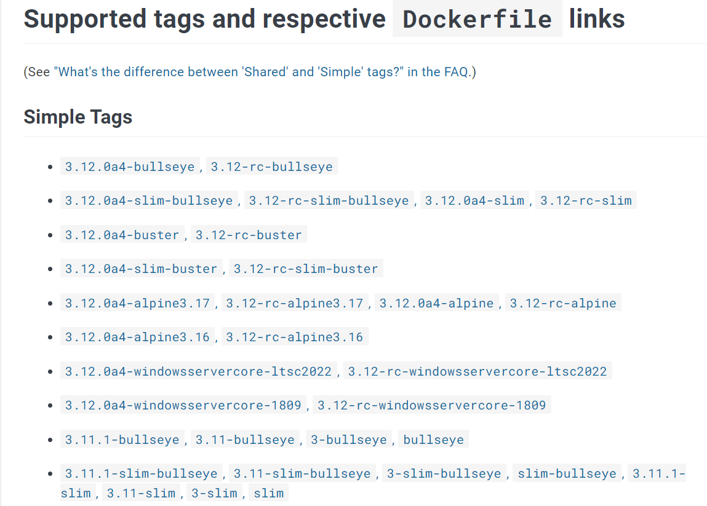

To run a Docker image, you'll need to specify its name and tag as `<label>:<tag>`. Let's run some code in the `python:3.12-slim` image, as you can guess a _small_ image with Python 3.12 installed.

!!! note "Exercise - Run your first container"
    - Find the [command](https://docs.docker.com/engine/reference/commandline/pull/) to download the `python:3.12-slim` image in your set of available images.
        - Check the image is available with `docker images`
    - Run a container from the image with `docker run -it --rm python:3.12-slim`.
        - The `-it` flag is shorthand for `-i -t`, short for _interactive_ and _tty_. This opens a tty terminal to your container.
        - The `--rm` flag tells the Docker Daemon to clean up the container after exiting.
    - By default the `run` for the image will put you in a Python shell. Try to run some Python code and play with the walrus operator.
        - Docker gives you an easy way to test new Python versions without installing it on your system.
    - Exit the container by typing `exit()` in the command. 
    - Make sure the container has disappeared with `docker ps -a`.
    - Run the docker run command again without the `--rm` flag. 
        - Run `docker run -it --name test python:3.12-slim` and then exit the container. What displays this time in `docker ps -a` ?
    - Since we gave a name to our container, let's restart it with `docker start test`. You can then reattach to it with `docker attach test`.
    - We had enough fun with that container, destroy it by using the `docker rm` command.
    - Let's clean up our images a little bit, delete the `python:3.12-slim` image with the `docker rmi` command.

Most modern libraries have a dedicated Docker image maintained by the community. Do not hesitate to browse [the Docker Hub](https://hub.docker.com/) to test the latest systems.

What if you want to use a Python image but don't want to use its Python shell?

!!! note "Exercise - Changing the CMD of the image"
    - In an Anaconda prompt, run `python -m http.server 9999`. In a browser, connect to <http://localhost:9999>. 
        - What is the `http.server` program in Python?
        - Close it with `CTRL + C`.
    - Let's run this command in a Docker container! Run `docker run -it --rm -p 9999:9999 python:3.12-slim python -m http.server 9999`. connect to <http://localhost:9999> in your browser.
    - What is the `-p 9999:9999` flag? 
    - How do you connect to the http server if you run the command with `-p 7777:9999` instead?

This way we now can download an image, run it with a custom command and expose some of the ports to us.

!!! danger "Challenge"
    - In a folder with some Python notebooks you copied from some other projects you want to use, run the following command: `docker run -v <current directory>:/tmp/working -w=/tmp/working --rm -it -p 8888:8888 kaggle/python jupyter notebook --no-browser --ip=0.0.0.0 --allow-root --NotebookApp.token="" --notebook-dir=/tmp/working`.
        - The `<current directory>` should be replaced by `%cd%` in Windows Command line, `${PWD}` in Powershell and `$(pwd)` in WSL2.
        - This is the notebook that is used by Kaggle notebooks, with all the necessary Data Science packages to work on your projects! But it is very big, it might takes several minutes to download.
        - Carefully read each part of the command and prepare to be able to explain each part to me.
        - The only flag you currently don't know is `-v`. It mounts one of your local folders to a folder inside the running container, so that you can see your local Jupyter notebooks from inside the containers. You can edit a file in the Jupyter notebook and see the changes locally (though I don't recommend doing it like this because of line separator risks).

### b. Your first Dockerfile

Our goal is to create our own Docker image, using a `Dockerfile`.

!!! note "Exercise - Folder architecture"
    - Put yourself in a brand new folder, like `mlops-td`. 
    - In this `mlops-td` folder, create a new folder, name it however you like. For example `td`.
    - Create the following empty files:

    ```
    td
     ├── app.py             <- A python script
     ├── requirements.txt   <- Python packages (feel free to install packages you like)
     └── Dockerfile         <- Has the Docker commands to build our custom image
    ```

    - Write some Python code in `app.py`. Printing `Hello World` is good enough.

!!! note "Exercise - Dockerfile"
    - Open the `Dockerfile` file with your favorite editor (I would recommend opening the `mlops-td` folder with [VSCode](https://code.visualstudio.com/)).
    - Write down the following lines into `Dockerfile`:

    ```Dockerfile
    FROM python:3.12-slim

    COPY requirements.txt /app/requirements.txt

    WORKDIR /app 
    RUN pip install -r requirements.txt

    COPY app.py app.py

    CMD ["python", "app.py"]
    ```

    ??? abstract "Explaining the Dockerfile commands"
        - `FROM` specifies the parent image [link](https://docs.docker.com/engine/reference/builder/#from)
        - `COPY` copies files or directories from the folder you ran docker from, into the image (at the current selected `WORKDIR`). [link](https://docs.docker.com/engine/reference/builder/#copy)
        - `WORKDIR` puts the image location to the desired folder. In this example, all future commands will be run inside the `/app` folder, like if you did a `cd /app`. [link](https://docs.docker.com/engine/reference/builder/#workdir)
        - `RUN` runs a classic UNIX command. Use them to install stuff. [link](https://docs.docker.com/engine/reference/builder/#run)
        - `CMD` defines the command the Docker image will run by default. [link](https://docs.docker.com/engine/reference/builder/#cmd)

    - To run the building of the image, run `docker build -t td:0.1 ./`
        - the `-t` is the name (`td`) and tag (`0.1`) of the image.
        - the `./` specifies the current folder which contains the `Dockerfile` to build. If you're not in the folder, point to the path accordingly.
    - Make sure the new `td:0.1` image was created. What is the size of the image?
    - Run your new image and verify the code from your `app.py` script runs correctly.
    - Try to add dependencies in the `requirements.txt` file. When you rerun the same `build` command, do you notice something in the print output? 
        - You should see ` ---> Using cache` appear in particular places, telling you it didn't start the build from scratch.

!!! danger "Challenge"
    - Create a Docker image which contains a copy of any of your Jupyter notebooks and installs the `jupyterlab` dependency. When the container runs, a Jupyter lab server should run. I should be able to access every notebook at the root.
    - Mount a folder with Jupyter notebooks into a volume using the `-v <current directory>:/tmp/working` flag. Check any edit you do on a notebook in the container is stored on your disk.
        - The `<current directory>` should be replaced by `%cd%` in Windows Command line, `${PWD}` in Powershell and `$(pwd)` in WSL2.

## 2. Running multiple microservices together with docker compose

With `docker-compose`, you are able to run a group of containers altogether. In this tutorial, we will setup a 3-tier architecture with Docker compose, by running a Docker container for each tier.

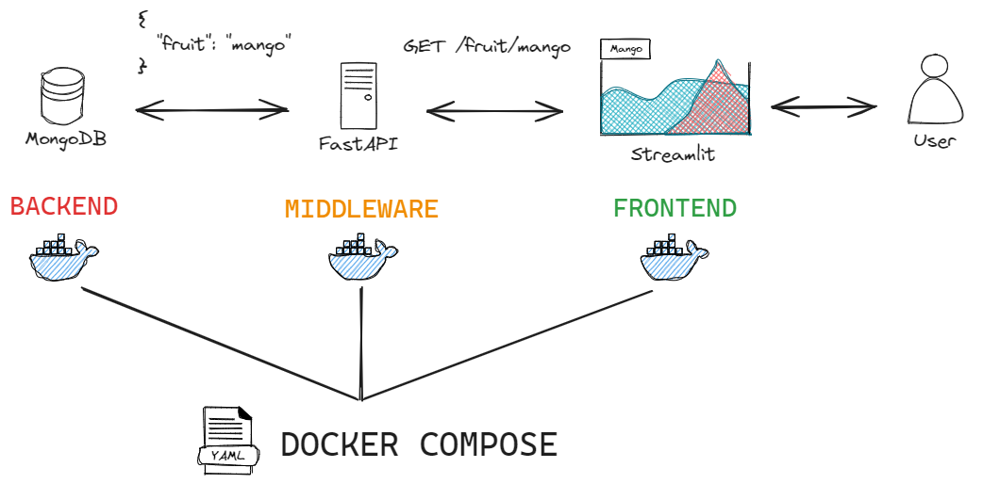

### a. Developing the FastAPI API locally

!!! note "Exercise - Architecture"
    - In the `mlops-td` folder, build the following folder architecture
    ```
    mlops-td
    ├── client
    |      ├── app.py             <- Streamlit/Gradio/Panel/Dash/Shiny to request a REST API
    |      ├── requirements.txt   <- Python packages
    |      └── Dockerfile         <- Commands to build our custom image
    |    
    ├── server
    |      ├── app.py             <- FastAPI to expose a REST API that will write to MongoDB
    |      ├── requirements.txt   <- Python packages
    |      └── Dockerfile         <- Commands to build our custom image
    |
    ├── td                        <- Contains your previous exercise
    | 
    └── docker-compose.yml
    ```

!!! abstract "Prerequisites - Install Python dependencies in a local Conda environment"
    - In a new `Anaconda Prompt`, create a new conda environment (call it `mlops` if you want)
    - Activate the created environment
    - In this environment, install `fastapi`, `streamlit`, `uvicorn` and `pymongo`: `pip install fastapi streamlit uvicorn pymongo`
    - Check that both `docker` and `conda` can be used from your command line.

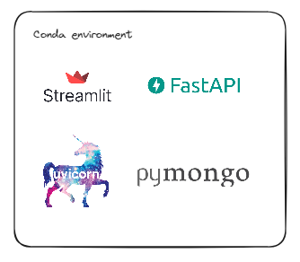

!!! note "Exercise - Build a Python REST API with FastAPI (a Flask alternative)"
    - In `server/app.py`, create a REST API with [FastAPI](https://fastapi.tiangolo.com/tutorial/first-steps/) so that:
        - when you run `uvicorn --reload --host 0.0.0.0 app:app` locally, from the `server` folder, you can connect to <http://localhost:8000> and get back `{"message": "Hello World"}`. 
        - when you connect to <http://localhost:8000/docs>, you can access the documentation page of your API like in the image below.
    
    Refer to the [Quick Start](https://fastapi.tiangolo.com/#example) to discover how to implement the API.

    ??? abstract "Solution ONLY if you feel stuck"
        ??? abstract "Are you really stuck :thinking: ?? Give it one last try :muscle:"
            Content of `server/app.py`:
            ```python
            from fastapi import FastAPI

            app = FastAPI()


            @app.get("/")
            async def root():
                return {"message": "Hello World"}
            ```

You should have the documentation of your FastAPI server running locally on <http://localhost:8000/docs>.

You can test any part of the API by clicking on the `Try it out button` on the top right of each resource:

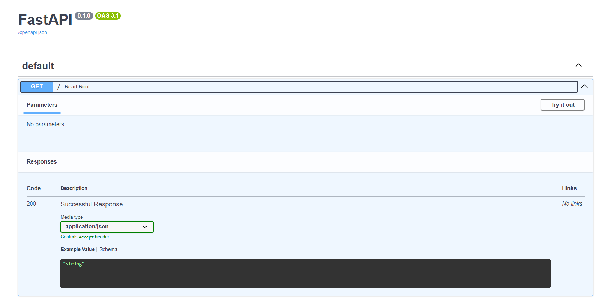

### b. Building the FastAPI Docker image

!!! note "Exercise - Run the FastAPI API in a Docker container"
    - In `server/Dockerfile`, install the dependencies from the local Conda environment.
    - In `server/Dockerfile`, run the command that runs the Uvicorn server through `CMD`. Use the `Dockerfile` from the previous part as template.
        - Do note that `"cmd --reload -h 127.0.0.1 app"` and [`"cmd"`, `"--reload"`, `"-h"`, `"127.0.0.1"`, `"app"`] are the same.
    - Build your image. Give it a label like `mlops-server`. Make sure if you run the container with the correct port exposed, you can connect to the API from the browser on <http://localhost:8000> and get your `Hello world`.

    ??? abstract "Solution ONLY if you feel stuck"
        ??? abstract "Are you really stuck :thinking: ?? Give it one last try :muscle:"
            Build with `docker build -t mlops-server .` . Run with `docker run -p 8000:8000 --rm mlops-server`. 
            ```Dockerfile
            FROM python:3.12-slim

            COPY requirements.txt /app/requirements.txt
            WORKDIR /app 

            RUN pip install -r requirements.txt

            COPY app.py app.py

            CMD ["uvicorn", "--reload", "--host", "0.0.0.0", "app:app"]
            ```

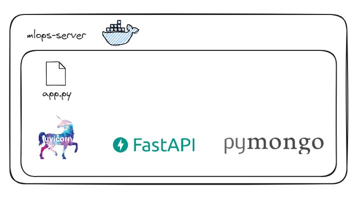

---

### c. Connecting the FastAPI Docker container to a Mongo container

We are going to add a MongoDB database next to our API, which is used to store JSON objects.

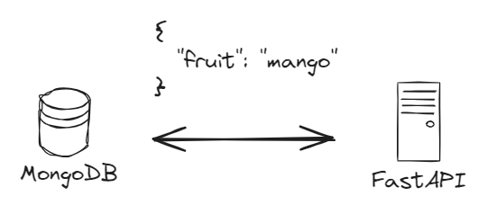

!!! note "Exercise - Run Mongodb in Docker, FastAPI locally"
    - Run a [MongoDB](https://hub.docker.com/_/mongo) container using the `docker run` command.
    - Let's add some code into `server/app.py` to push data into MongoDB. Here's code to push and retrieve a Python Dict into a running local MongoDB.
    
    ```python
    from pymongo import MongoClient

    client = MongoClient('localhost', 27017)
    db = client.test_database
    collection = db.test_collection

    def add_list_fruits(fruit):
        id = collection.insert_one({"fruit": fruit}).inserted_id
        return list(collection.find({}, {"_id": False}))
    ```

    - Create a new `GET` method so that if you connect to `/add/mango` it adds `{fruit: mango}` to mongodb, and another `GET` method `/list` that returns all fruits in MongoDB.
        - Use [the Path params doc](https://fastapi.tiangolo.com/tutorial/path-params/) to get started
    - Run your FastAPI server locally. From <http://localhost:8000/docs>, you can try out the API examples and check that data is returned correctly.

    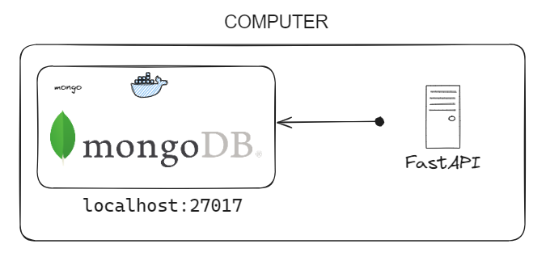

    ??? abstract "Solution ONLY if you feel stuck"
        ??? abstract "Are you really stuck :thinking: ?? Give it one last try :muscle:"
            Run MongoDB with `docker run -it --rm --name some-mongo -p 27017:27017 mongo:4`.

            My `server/app.py` content:
            ```python
            from fastapi import FastAPI
            from pymongo import MongoClient

            app = FastAPI()
            client = MongoClient('localhost', 27017)
            db = client.test_database
            collection = db.test_collection

            @app.get("/")
            async def root():
                return {"message": "Hello World"}

            @app.get("/add/{fruit}")
            async def add_fruit(fruit: str):
                id = collection.insert_one({"fruit": fruit}).inserted_id 
                return {"id": str(id)}

            @app.get("/list")
            async def list_fruits():
                return {"results": list(collection.find({}, {"_id": False}))}
            ```

!!! note "Exercise - Run Mongodb and FastAPI in separate Docker containers"
    - Add the following code in `docker-compose.yml`. This will start a Mongodb next to your server image:
    
    ```yaml
    version: '3'

    services:
        mongo:
            image: mongo

        server:
            image: mlops-server
            build:
                context: ./server
                dockerfile: Dockerfile
            ports:
            - 8000:8000
    ```

    - Run the cluster with `docker-compose up`, from the root folder (where `docker-compose.yml` is).
        - **BEWARE**! only works if your `mlops-server` image has already been built
        - Check that you have indeed 2 containers running.
    - Close the cluster with `CTRL+C`, and destroy it with `docker-compose down`. A `docker ps -a` should show no containers remaining.
    - In `server/app.py`, change `client = MongoClient('localhost', 27017)` into `client = MongoClient('mongo', 27017)`. 
        - It is docker-compose that redirects the `mongo` URL/service into the `mongo` container.
    - Because the image building info is in `docker-compose.yml`, you can rebuild the images immediately with `docker-compose up --build` instead. Try it out.
    - Connect to your API with <http://localhost:8000/docs> running in a container. Make sure you can still add and get objects from MongoDB through the API.

    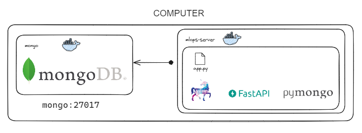

### d. Adding the User Interface layer with Streamlit

Instead of connecting to the FastAPI documentation page to interact with it, let's create a simple Streamlit UI to interact with the API.


!!! note "Building a Streamlit UI connected to the API"
    - Make sure your docker-compose FastAPI + MongoDB cluster from the previous section is running.
    - Build a local [Streamlit](https://docs.streamlit.io/) _(or Gradio or Dash or Shiny or whatever)_ app in `client/app.py` with a text input to write down a fruit and a button to request the `http://server:8000/add/<fruit>`. 
        - The command to run a Streamlit app from your conda environment is `streamlit run app.py`
        - Here is some code to put in `client/app.py` to react to a button click:

    ```python
    import streamlit as st

    st.title("My beautiful App")
    button_clicked = st.button("Click me")
    
    if button_clicked:
        st.write("It worked")
        st.balloons()
    ```

    - Get back the list of all fruits currently in Mongo from the API by hitting <http://localhost:8000/list> on clicking from another button.

!!! warning "Challenge - Building our first Dockerized Fullstack web service"
    - Implement `client/Dockerfile`, build it as `mlops-client`. Make sure you can properly run it without `docker compose`
    - Add the Streamlit UI container run to `docker-compose.yml`.
        - Don't forget to change the URL of your `MongoClient`
    - Restart your `docker-compose` cluster.
        - If all is well, in your 3-tier architecture, Streamlit is only hitting FastAPI and only FastAPI is hitting MongoDB. 
        - That way you can add authentication or security measures at FastAPI level, which would be harder to do if the client immediately hit MongoDB.


## 3. A full-stack Dockerized ML project

Pick up a classification training dataset, like Iris or Penguins. The goal is to build a fully functional `docker-compose` app that provides an UI to do predictions on a pretrained ML model.


!!! warning "Challenge"
    - Create a `server/train.py` script, that trains a scikit-learn model over the [Iris](https://scikit-learn.org/stable/modules/generated/sklearn.datasets.load_iris.html) or any other classification dataset (as long as it doesn't have too many features). When you run it locally with `python train.py`, it should create a `model.pkl` file (as pickle or using joblib). This pickled model should then later be copied into the FastAPI Docker image. 
    - The client should be a Streamlit _(or Gradio or Dash or Shiny or whatever)_, exposing all feature columns of the dataset we want to use to make a prediction.
    - The server should be a FastAPI API, which exposes a POST verb `predict`. If you send `POST /predict` with a body containing the values of the features, like `{"sepal_length": 42, "petal_length": 34...}` it should return the predicted class from a pretrained model. Following is an example of reacting to a POST request in FastAPI:

    ```python
    from fastapi import FastAPI
    from fastapi.encoders import jsonable_encoder
    from pydantic import BaseModel

    class Item(BaseModel):
        sepal_length: float
        sepal_width: float
        petal_length: float
        petal_width: float

    app = FastAPI()

    @app.post("/predict")
    def predict(item: Item):
        item_data = jsonable_encoder(item)
        return item_data
    ```

    - The client should request the `http://server:8000/predict` with the features in the body to get back a class to display.
    - Add a `README.md` to your project to describe how to clone & run the project. 
        - Normally, I should just need a `docker compose up --build` to build and run the Docker image.

Good Luck, Have Fun :tada:!

## ===== Bonus Challenges =====

The following exercises are optional bonuses if you want to go the full MLOps route. 

You can do them in any order.

## 4. Github & CI/CD

We can push the MLOps images to a Github project so anyone can download them.

### a. Create a Github repository for your MLOps project

!!! note "Exercise - Create a new Github repo"
    - Create a new `mlops` repo with a `README.md` on your Github profile (or any random file). 
        - You should see a new `Packages` in the bottom right of the project
        - If you can't see it, head to the `Settings` gear icon next to the `About` section and check the `Packages` option.

    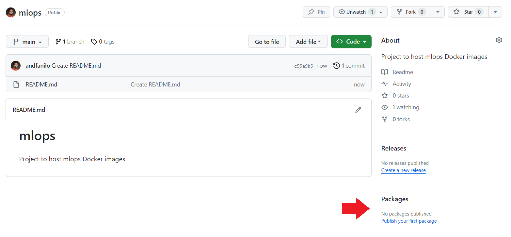

    - Click on the `Publish your first package` option. We will be using the `Containers` option.

    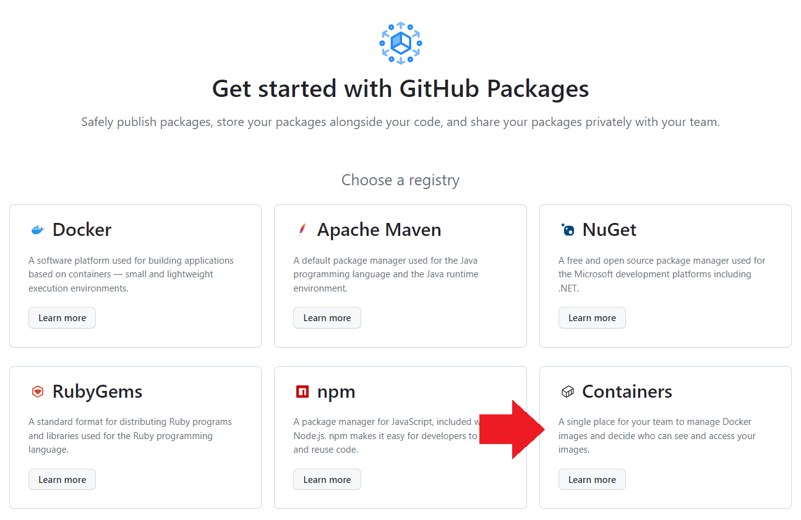

    - Can you find the pricing for the Containers service?

### b. Authenticating to Github using a personal access token

To upload an image to the Github Packages, you will need to authenticate from Command line using a [personal access token (classic)](https://docs.github.com/en/authentication/keeping-your-account-and-data-secure/managing-your-personal-access-tokens#creating-a-personal-access-token-classic) before you can push Docker images to the Github project. 

!!! warning "Personal Access Token are secrets"
    A personal access token is different than your Github password, and while you can revoke them if you leak them online, treat them with the same importance as a password so **handle it with care**.

!!! note "Exercise - Create a personal access token"
    * Follow all instructions in [this tutorial](https://docs.github.com/en/authentication/keeping-your-account-and-data-secure/managing-your-personal-access-tokens#creating-a-personal-access-token-classic).
        * Scope of the token should have at least **write:packages** and **delete:packages** 
        * Copy your token in a safe space, you'll have to copy it in the command line when required.
        * Careful, anyone who gets this personal access token can access any of your public/private repositories, handle with care.

    - In the following image, I have 2 personal token with different access properties. I can delete any whenever I want
    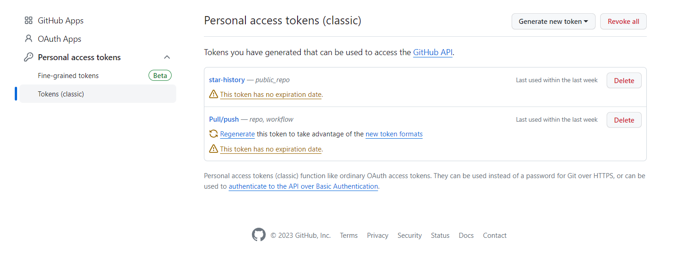

### c. Push a Docker image to the Github project

To push a Docker image to Github, it needs to follow the following name convention: `ghcr.io/NAMESPACE/IMAGE_NAME:latest`. You will need to rename your images.

For example, I would need to rename my image to `ghcr.io/andfanilo/mlops:latest`, because

- `andfanilo` is my profile name, so it's the `NAMESPACE`
- `mlops` is the name of my repo, so it's `IMAGE_NAME`
- `latest` is the default tag. You can put any tag like `v0.1` but stick to `latest` for now.

The following exercise involves the `git` command, make sure you use `git bash` or install `git` in a conda environment.

!!! note "Exercise - Pushing an image to Github"
    - Run `docker images`

    ```sh
    REPOSITORY     TAG       IMAGE ID       CREATED       SIZE
    mlops-client   latest    855e076c7e32   6 days ago    583MB
    mlops-server   latest    efac786ed274   6 days ago    464MB
    mongo          latest    021b676f1558   3 weeks ago   757MB
    ```

    !!! warning "Github Packages free tier"
        If you remember from the [pricing page](https://github.com/settings/billing/summary) you are limited to a monthly:

        - 500Mb of Packages storage
        - 1 Gb of transfer out

        Our docker images are 500Mb, way too large for the current free tier. There are ways to [reduce the image size](https://pythonspeed.com/articles/smaller-docker-images/), but honestly we won't be  able to squeeze our Streamlit/FastAPI images to 500Mb, even if the price for hosting is actally [pretty low](https://github.com/pricing/calculator?feature=packages). Let's use a very small image to train for now.

    - Pull the docker `hello-world` image, check out its size is around 10Kb.

    ```sh
    $ docker images
    REPOSITORY     TAG       IMAGE ID       CREATED       SIZE
    mlops-client   latest    855e076c7e32   6 days ago    583MB
    mlops-server   latest    efac786ed274   6 days ago    464MB
    mongo          latest    021b676f1558   3 weeks ago   757MB
    hello-world    latest    9c7a54a9a43c   7 months ago    13.3kB
    ```

    - Rename the `hello-world` image to comply with the Github Packages URL: `docker image tag hello-world:latest ghcr.io/your-name/mlops:latest`

    ```sh
    $ docker images
    REPOSITORY                TAG       IMAGE ID       CREATED          SIZE
    mlops-client              latest    4f17fd22a93b   16 minutes ago   488MB
    mlops-server              latest    efac786ed274   6 days ago       464MB
    mongo                     latest    021b676f1558   3 weeks ago      757MB
    hello-world               latest    9c7a54a9a43c   7 months ago     13.3kB
    ghcr.io/andfanilo/mlops   latest    9c7a54a9a43c   7 months ago     13.3kB
    ```

    - Try to push the `ghcr.io/your-name/mlops:latest` image to Github: `docker push ghcr.io/your-name/mlops:latest`

    ```sh
    $ docker push ghcr.io/andfanilo/mlops:latest
    The push refers to repository [ghcr.io/andfanilo/mlops]
    01bb4fce3eb1: Preparing
    unauthorized: unauthenticated: User cannot be authenticated with the token provided.
    ```

    - To authenticate with your personal access token in place of password: `docker login ghcr.io -u GITHUB_USERNAME`
        - Take note that when you enter letters or paste in the `Password:` field, no stars will appear to show a character count. This is normal, proceed.

    ```sh
    $ docker login ghcr.io -u andfanilo
    Password:
    WARNING! Your password will be stored unencrypted in /home/docker/.docker/config.json.
    Configure a credential helper to remove this warning. See
    https://docs.docker.com/engine/reference/commandline/login/#credentials-store

    Login Succeeded
    ```

    - Try to push again

    ```sh
    $ docker push ghcr.io/andfanilo/mlops:latest
    The push refers to repository [ghcr.io/andfanilo/mlops]
    01bb4fce3eb1: Pushed
    latest: digest: sha256:7e9b6e7ba2842c91cf49f3e214d04a7a496f8214356f41d81a6e6dcad11f11e3 size: 525
    ```

    - Though the Docker image has been pushed to you Github project, it is still private and invisible. You can find it on your profile page: <https://github.com/your-profile?tab=packages>. Connect it to your `mlops` repository through [this tutorial](https://docs.github.com/en/packages/learn-github-packages/connecting-a-repository-to-a-package). A Docker package should finally appear on your repository.

    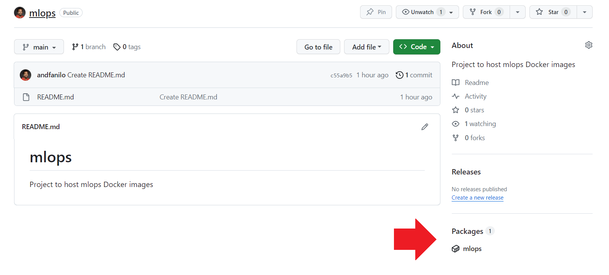

    - Ask a friend to download your image!

There are other Docker registries to push images to, like [Docker Hub (which has a better free tier)](https://hub.docker.com/), [Gitlab](https://gitlab.com/) and [Quay.io](https://quay.io/). Every Cloud Provider (AWS/Azure/GCP) also have their dedicated container registry per project, you'll be expected to push images there in customer projects.

### d. Continuous integration with Github Actions 

CI/CD is an acronym that stands for Continuous Integration (CI) and Continuous Deployment or Continuous Delivery (CD). It's a methodology that modern software development teams use to deliver code changes more frequently and reliably.


* CI: Each code change triggers an automated build and testing sequence. Any time to push commits to Github, a new Docker image with the changes should be built and stored in Github Packages
* CD: After building a new image, automatically deploy every change that passes the build and test stages to a production environment

In our MLOps tutorial, CI/CD refers to the continuous integration and delivery of up-to-date Machine Learning APIs.

!!! note "Exercise - Github Actions quick start"
    Run through the Github Actions quick start on your `mlops` Github project: <https://docs.github.com/en/actions/quickstart>

!!! warning "Challenge - Rebuild the `hello-world` image at every commit"
    - Create a new Dockerfile in the `mlops` project. This Dockerfile should use the `hello-world` base image but change the `CMD` to print something (like an environment variable)
    - Edit the `.github/workgflows/github-actions-demo.yml` (or however you named it) to build the new image and push it to the project's container registry automatically at every commit push. 
        - [This link should teach you how to push](https://docs.github.com/en/actions/publishing-packages/publishing-docker-images#publishing-images-to-github-packages) 
        - and [this one will help you configure Docker login to your Github project](https://docs.github.com/en/actions/security-guides/using-secrets-in-github-actions#creating-secrets-for-a-repository).
    - Push a new commit, wait for the image build, then redownload the Docker image locally an try running it.

You are now able to host up-to-date images on Github.

## 5. Deploying to Huggingface Spaces

The Hugging Face Hub is a platform with over 350k models, 75k datasets, and 150k demo apps (Spaces), all open source and publicly available, in an online platform where people can easily collaborate and build ML together. The Hub works as a central place where anyone can explore, experiment, collaborate, and build technology with Machine Learning.

Hugging Face Spaces offer a simple way to host ML demo apps directly on your profile or your organization’s profile. It's the perfect platform to deploy small ML apps in Streamlit, Gradio or Docker. All CI/CD is preconfigured on Huggingface Spaces, any code change you push will automatically rebuild and redeploy the app online.

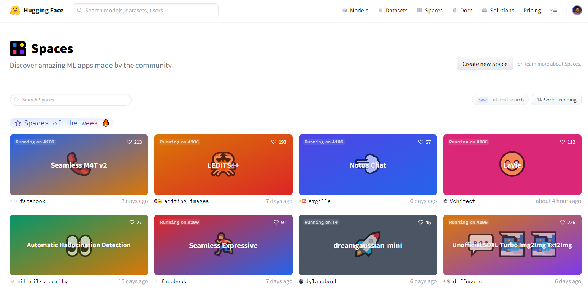

!!! danger "Challenge - Deploy a Docker image on Huggingface Spaces"
    - Create an account on [HuggingFace](https://huggingface.co/)
    - Follow the Docker Spaces quick start: <https://huggingface.co/docs/hub/spaces-sdks-docker-first-demo>
    - Create a new project for your `mlops-server` FastAPI part and deploy it on Huggingface Spaces. Your local Streamlit app should be able to use it for predictions.

## 6. Enhancing the Docker Compose for Continuous Deployment

We can use a MLOps platform to:

- track training experiments
- store and evaluate models in a registry for reuse
- package models into APIs and Docker images

Popular platforms are [MLFlow](https://mlflow.org/), [Neptune](https://neptune.ai/) and [Weights & Biases](https://wandb.ai/).

### a. Adding MLFlow

Using the `ghcr.io/mlflow/mlflow` Docker image, you can start a MLFlow Model Registry, and send Scikit-Learn models there with associated metrics.

For example if you start a MLFlow Server with `docker run -it --rm -p 5000:5000 ghcr.io/mlflow/mlflow mlflow server -h 0.0.0.0 --backend-store-uri sqlite:///mydb.sqlite`, you can use the following code to train a model and push it to the MLFlow Server with its evaluation metrics:

```python
import numpy as np
from sklearn.metrics import mean_squared_error, mean_absolute_error, r2_score
import mlflow
import mlflow.sklearn

def eval_metrics(actual, pred):
    rmse = np.sqrt(mean_squared_error(actual, pred))
    mae = mean_absolute_error(actual, pred)
    r2 = r2_score(actual, pred)
    return rmse, mae, r2

with mlflow.start_run():
    lr = ElasticNet(alpha=alpha, l1_ratio=l1_ratio, random_state=42)
    lr.fit(train_x, train_y)

    predicted_qualities = lr.predict(test_x)

    (rmse, mae, r2) = eval_metrics(test_y, predicted_qualities)

    # send to MLFlow
    mlflow.log_param("alpha", alpha)
    mlflow.log_param("l1_ratio", l1_ratio)
    mlflow.log_metric("rmse", rmse)
    mlflow.log_metric("r2", r2)
    mlflow.log_metric("mae", mae)

    mlflow.sklearn.log_model(lr, "model", registered_model_name="ElasticnetWineModel") 
```

You should be able to visualize you model on the dashboard <http://localhost:5000>.

!!! danger "Challenge"
    - Use the previous challenge as template to create the above architecture, adding a MLFlow service in `docker-compose`. You now have a `client` Streamlit, `FastAPI` server and `MLFlow` backend.
    - Locally, in the `train.py` that trains your ML Model, log your model into MLFlow.
    - In your `FastAPI` server, load the model from MLFlow 
    ```python
    model = mlflow.pyfunc.load_model(
        model_uri=f"models:/{model_name}/{model_version}"
    )
    ```
    - Add an API endpoint like `GET /update-model` that loads a new model from MLFlow.
    - From the client, add a button to update a model.

You can now decide to update models from the client, or detect data drift by storing the latest instances server side/in a database and using [whylabs](https://github.com/whylabs/whylogs) to detect a drift and train a new model.


### b. Adding Prefect

Instead of running `train.py` to retrain a model on demand, you can schedule the run using [Prefect](https://www.prefect.io/), [Dagster](https://dagster.io/) or [Airflow](https://airflow.apache.org/)

!!! danger "Challenge"
    - Locally, use Prefect to schedule a `train.py` run every 5 minutes.
        - Visualize all runs in their respective UIs.
    - Build a Docker image which will contain your Prefect/Airflow and add it to `docker-compose.yml`. In the end you should have the following architecture

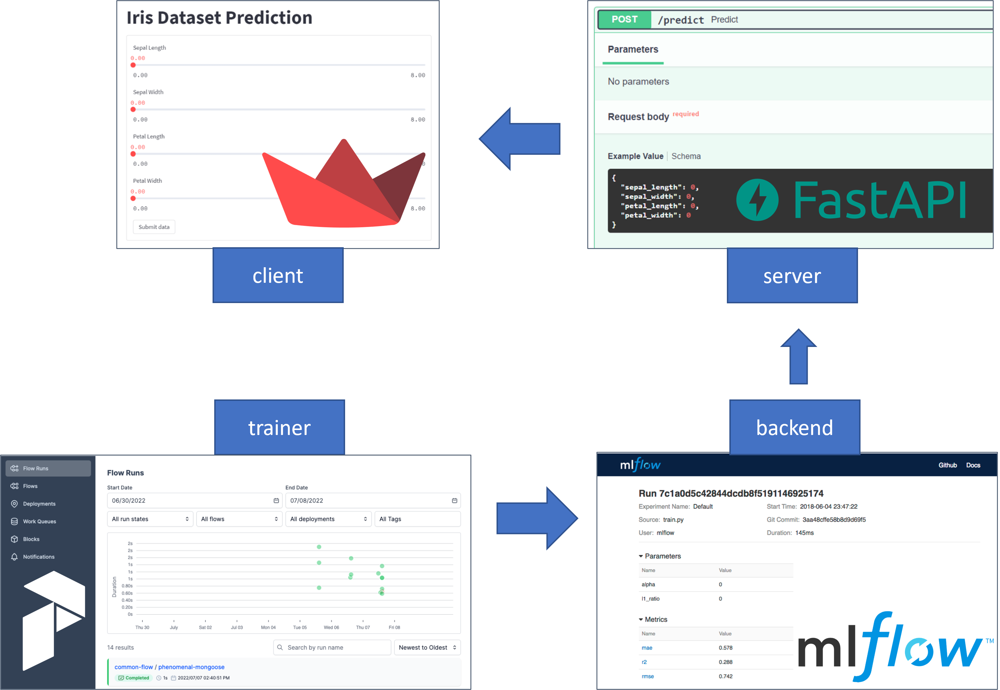