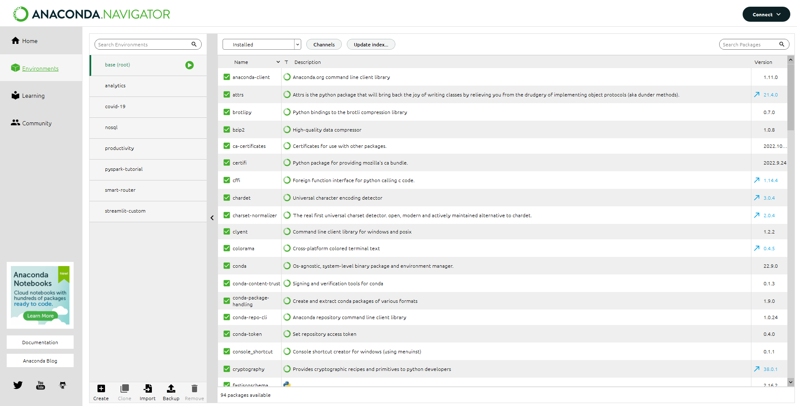

# TD0 - Tooling

For this tutorial, you will be installing and configuring tools used in the following tutorials:

- Command line
- Docker
- Git
- Conda
- Python librairies: Streamlit & FastAPI

## Objectives

- [ ] Get used to using your command prompt
- [ ] Create a conda environment with Python 3.9, FastAPI and Streamlit
- [ ] Reinstall Docker to ensure a clean docker-compose environment
- [ ] Git clone the NoSQL or Spark tutorial

---

## 1. Test your command line skills

!!! warning "Try to do this without ChatGPT"
    Those are skills you will want ingrained in your brain for the rest of your developer career :smile:

!!! note "Exercise - Getting used to the Windows Prompt"
    1. Open your Command Prompt Terminal from the Start Menu.
    2. Open your Explorer.
    3. Select a random folder that has files in your Explorer, and browse to this folder from the Command Prompt
        - You can either use multiple `cd` commands, by pressing `tab` to autocomplete the folder to browse into. You can also copy-paste the full link from the Explorer into the command line.
    4. List all files in the folder in your Command Prompt.

The Windows and Unix command line terminals have different commands. 

In the following exercises, we will be using the Anaconda command-line, which comes with Unix commands.

---

## 2. Create a complete Python environment

While you usually install and use [Anaconda](https://docs.anaconda.com/) as a Python distribution with a lot of Data Science packages preinstalled, Anaconda comes with a package and environment manager called `conda`. 

You may have seen the list of environments managed by your current conda installation when browsing the Anaconda Navigator.

In the following, we won't be using the Anaconda Navigator UI. Brush up your Unix skills :smiling_imp:. 

!!! note "Exercise - Installing a new Conda environment"
    1. Open the Anaconda 3 (64-bit) prompt from the Start Menu.
    2. Create a new environment (with any name you'd like) with python 3.9 installed.
        - The command looks like `conda create -n <name_of_env> python:<version> <space_separated_packages>` 
    3. Ensure your environment is present by listing all current conda environments.
        - The [Conda Cheatsheet](https://docs.conda.io/projects/conda/en/latest/user-guide/cheatsheet.html) will definitely be of help to find the command. Or ChatGPT...
    4. You need to `activate` your conda environment to access its `python`, `pip` and `conda` environment-specific commands. What command is responsible for this? When used, how do you know you're in the correct environment?
    5. To ensure Python is properly installed:

        a. Run `python -v` to check the Python version

        b. run `python -m http.server` to have Python run an HTTP server on `http://localhost:8000`.
    5. We now install some packages in your newly created and activated environment:
        
        a. Install non-Python pakages like `git` with the `conda install` command.
        
        b. Install Python packages like `streamlit`, `fastapi` and `jupyter` with `pip`. Use the `pip install` command to install Jupyter Notebook and JupyterLab. Test the `jupyter notebook` and `streamlit version` command to ensure it works    

!!! question
    - Why should you get in the habit of installing every Python package with pip and every non-Python one with conda?

---

## 3. Repair your Docker environment

Depending on how Docker was installed, it may be that `docker compose` does not work correctly.

Just like for Anaconda, try your best to not use the Docker dashboard, instead go through the command line. You won't have a dashboard when manipulating Docker in production.

!!! note "Exercise - Testing Docker commands"
    1. Open the Anaconda 3 (64-bit) prompt or Git Bash from the Start Menu.
    2. Test the following commands:

        a. `docker version` 

        b. `docker compose version`

        c. `docker images`

        d. `docker pull hello-world`

        e. `docker run hello-world`

        f. `docker ps -a`

    If one of these doesn't work, especially the `docker compose version`, you probably need to uninstall and reinstall [Docker Desktop](https://www.docker.com/products/docker-desktop/).

---

## 4. Git clone a Jupyter project

!!! note "Exercise - Git cloning a project"
    1. Open Git Bash the Start Menu.
    2. Browse into your folder of choice for noew projects. This is a Unix terminal so commands will differ a little from the previous Windows prompt exercise
    3. Clone the spark tutorial on https://github.com/andfanilo/pyspark-tutorial to your folder
    4. Activate the conda environment you created some exercises above, which has Jupyter installed.
    5. Run `jupyter notebook` and make sure you can read all Spark notebook exercises.

---

## Recap

!!! success "Check that you can explain your neighbor each point of the checklist below"
    - [x] Get used to using your command prompt
    - [x] Create a conda environment with Python 3.9, FastAPI and Streamlit 
    - [x] Reinstall Docker to ensure a clean docker-compose environment
    - [x] Git clone the Spark tutorial

Take note of those 4 tools, they will be regularly reused throughout the tutorials.

In the next tutorial, we will delve into dockerizing a ML Prediction service with FastAPI and Streamlit.